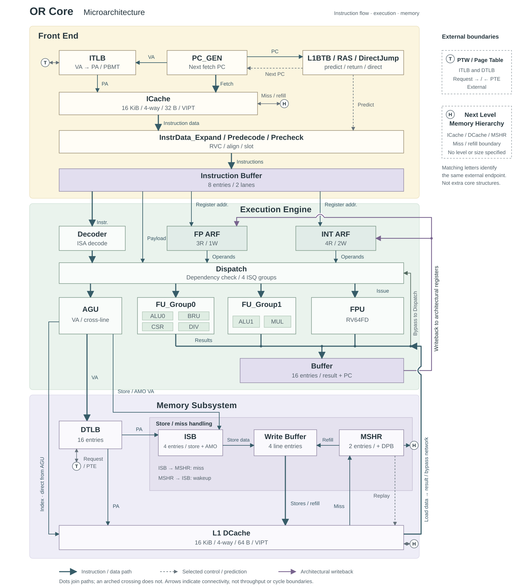
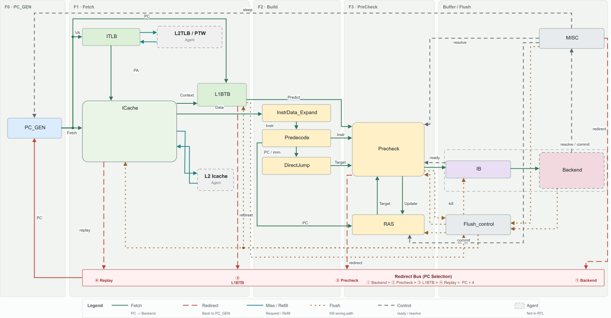
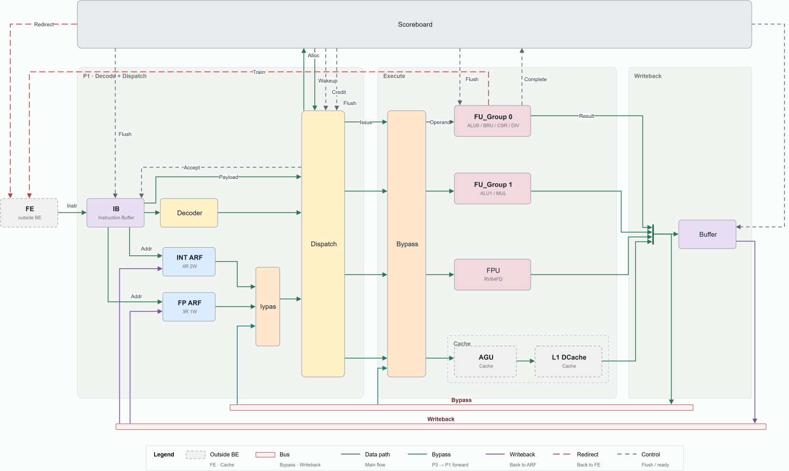
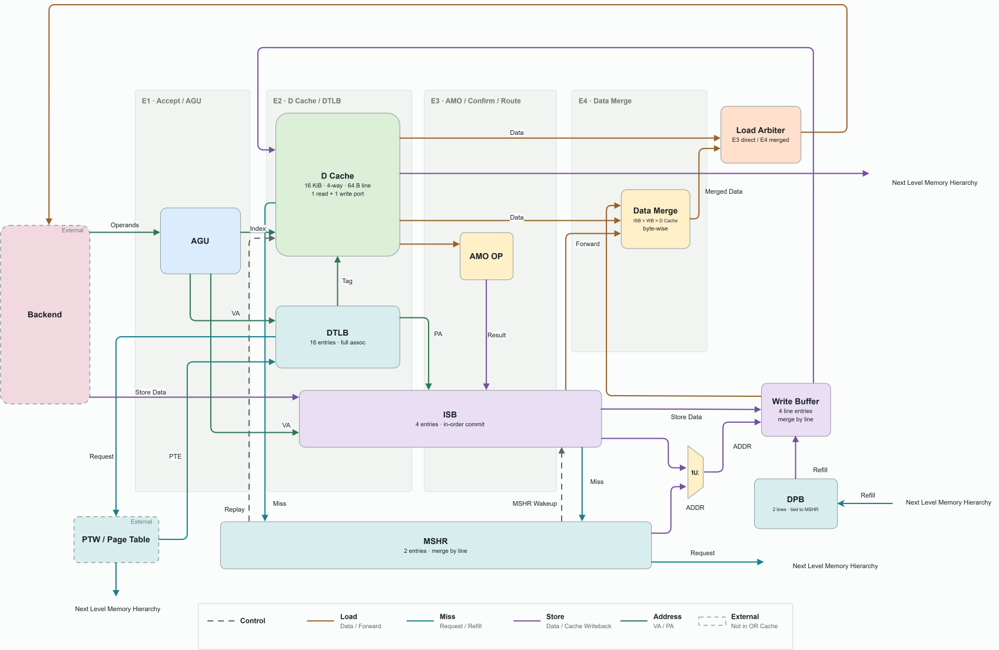

# OpenRio

## 1. Microarchitecture Overview

OpenRio is an open-source, complete dual-issue RISC-V processor core targeting the I, M, A, F, D and C extensions; the compressed (C) extension is decoded inside the frontend. Its performance goal is comparable to the ARM Cortex-A53. Three subsystems — an instruction frontend (FE), an out-of-order execution backend (BE) and a cache subsystem — are joined by a frozen, tag-based BE↔memory interface; architectural state advances only at in-order commit.



### 1.1 Instruction Frontend

The frontend fetches one 32-byte line per cycle across five stages: S0 generates the fetch PC and reads ICache and L1BTB; S1 translates through the ITLB and compares ICache tags; S2 predicts and predecodes while RVC expansion and operand extraction run in parallel; S3 prechecks and truncates; S4 enqueues up to two instructions per cycle into the backend IB.

The ICache is 16 KiB, 128 sets × 4 ways, VIPT with 32-byte lines; the L1BTB (256 sets × 4 ways) is the only predictor. Correction has three layers — L1BTB in S2, Precheck in S3, backend redirect at commit — which `pc_gen` arbitrates with ICache replay. The frontend holds no architectural state and no prefetch buffer, so it relies solely on the backend IB.



### 1.2 Out-of-Order Backend

The backend executes out of order across P0–P4. An 8-entry IB buffers frontend instructions; P1 fully decodes, resolves dependencies, renames and dispatches up to two per cycle into four execution groups — G0 (ALU0/BRU, CSR, DIV), G1 (ALU1, MUL), G2 (FPU), G3 (LSU). Each group owns a single-entry issue queue and one writeback lane; wakeup is tag-based over four bypass lanes.

Renaming records producers only — one `{busy, tag}` map per register class — so there is no physical register file; architectural values live in `INT_ARF` / `FP_ARF`. A 16-entry in-flight window holds control state, result data and PC in the `CompletionScoreboard`, `Buffer` and `PC_File`. Two instructions commit in order per cycle, and every recovery event becomes a single global flush at that boundary.



### 1.3 Cache Subsystem

The cache subsystem provides the L1 data cache and address translation: 16 KiB, four-way, 64-byte lines, VIPT, write-back with write-allocate and tree-PLRU replacement. It accepts one request per cycle from G3 and never rejects a load; the only backpressure is a full store buffer.

Four stages E1–E4 form the datapath: address generation, D-cache/DTLB probe, AMO and forwarding confirmation, and data merge. E2–E4 never stall; a waiting request enters a 16-entry replay queue and re-issues from E1. Forwarding is confirmed twice — a byte-granular VA pre-filter in E2, an exact PA match in E3 — with priority ISB > WB > D cache. Stores commit in order through a four-entry store buffer; a two-entry MSHR with paired pending buffers handles misses; a four-entry write buffer merges by line and forwards to loads.



## 2. Source Code

All RTL is plain SystemVerilog under `src/core/`. Each subsystem has its own `<subsystem>_rtl_v1/` directory holding a `_pkg.sv` for shared types and parameters, a `_top.sv` for integration, and the leaf modules.

### `fe_rtl_v1/` — frontend

One module per pipeline role: `pc_gen`, `icache` with `tag_compare` and `mshr`, `itlb`, `l1btb`, `predecode`, `instr_data_expand`, `direct_jump`, `ras`, `precheck` with `slot_arb`, `ib_enq_window`, plus the control-plane `be_ctrl_reg` and `flush_control`.

### `be_rtl_v1/` — backend

Subdirectories follow the pipeline stages.

| Directory | Contents |
|---|---|
| `p1/` | `IB`, `decode`, `dependency_check`, `dispatch_logic`, `INT_ARF` / `FP_ARF`, `INT_tag_mapping` / `FP_tag_mapping`, `FP_read_address_mux`, `p1_ISQ_input_mux` |
| `p2p3/` | `ISQ_Group0`–`ISQ_Group3`, `p3_arbiter_G0` / `p3_arbiter_G1`, `FU_input_mux` |
| `p4/` | `CompletionScoreboard`, `Buffer`, `PC_File`, `flush_model`, `SerialInstructionTracker`, `system_instruction_handler` |
| `fu/` | `alu_simple`, `mul_simple`, `div_simple`, `csr_unit`, `fpu_simple` |
| `lsu/` | `g3_lsu_iface` — G3's interface to the cache subsystem |
| `pkg/` | `exe_subop_pkg`, `or_be_types_pkg` with its static checks, `fe_be_protocol_pkg`, `or_be_lsu_protocol_pkg`, `or_be_config_pkg` |
| `top/` | `backend_top` (integration) and `isq_payload_assembly` |

### `cache_rtl_v1/` — cache subsystem

`dc_agu`, `dc_dtlb`, `dc_l1d` with `dc_tag_compare`, `dc_isb`, `dc_amo_op`, `dc_mshr` with `dc_dpb`, `dc_missq`, `dc_wb`, `dc_data_merge`, `dc_ld_arb`, `dc_cdb`, `dc_flush_ctrl`, integrated by `or_cache_top`.

## 3. Verification

Verification is a Verilator build with instruction-level co-simulation against an ISA model. The testbench is self-checking: every instruction the RTL commits is compared, one by one, against the ISA model's result, so a divergence surfaces at the committing instruction.

The environment lives in `verification/orbe_bt_env/`. `tb/` holds the testbench — agents for the frontend, backend, cache and co-simulation, a checker, interfaces and packages; `dpi/` bridges SystemVerilog to the ISA model; `cfg/filelist/` holds the compile lists; `tools/` holds the two driver scripts.

Five DUT configurations can be built, so a subsystem can be verified in isolation:

| Kind | Design under test |
|---|---|
| `rtl_full` (default) | BE + FE + Cache |
| `rtl_fe` | BE + FE; the Cache is replaced by an agent |
| `rtl_cache` | BE + Cache; the FE is replaced by an agent |
| `rtl_v1` | BE only; FE and Cache are replaced by agents |
| `agent` | No RTL — the agents check the environment itself |

A run is judged by scanning its log for mismatches, `%Error`, assertion failures and DPI failures, together with the simulator exit code; a batch regression applies the same rule per case. Logs and summaries are written under `orbe_bt_env/sim/`, which is not checked in.

The acceptance set is 216 cases: `rv64ui` 104, `rv64um` 26, `rv64ua` 38, `rv64uf` 22, `rv64ud` 24, `rv64uc` 2.

## 4. How to Start

The flow is Linux-based; on Windows, use WSL. You need Verilator, a C++ toolchain, and `ripgrep` — the scripts use it to scan logs for failure keywords.

```bash
git clone --recursive https://github.com/RIOSLaboratory/OpenRio.git
cd OpenRio/verification/orbe_bt_env
```

Run a single case:

```bash
tools/verilator_cosim.sh run --tc $ISA_MODEL_ROOT/isa_case/rv64ui/rv64ui-p-add.riscv
```

This builds `rtl_full` (BE + FE + Cache), runs the case, and exits non-zero on failure. `--dut-kind` selects another configuration, `--tag` names the build, `--seed` changes the random seed, and `--no-build` reuses a previous build.

For a batch regression, build once under a tag and then run the case set against that build:

```bash
tools/verilator_cosim.sh build --tag myrun
tools/regress.sh rtl_full myrun 6     # <kind> <tag> <parallel jobs>
```

`regress.sh` runs the full 216-case set by default; pass a case list to run a subset. Per-case verdicts and totals land under `sim/verilator_<TAG>/regress/<kind>/`.

The ISA model is resolved in this order: a full checkout at `ISA_MODEL_ROOT`, an `isa_model/` directory found by searching upward from `verification/`, or the vendored `IsaApi.h` and `lib_ISA_api.so` under `dpi/`. The `isa_case/` test cases are not checked in — they come from the ISA model directory, so `ISA_MODEL_ROOT` must be set before a regression.

## About RIOS Lab


**Ecosystem Wants to be Free**

By David A. Patterson · Director of RIOS Lab

**RISC-V International Open Source Laboratory** (RIOS Lab) is a Shenzhen-based research facility focused on computer system architecture, supported by the Tsinghua-Berkeley Shenzhen Research Institute. As an Open Source and Nobel Prize Laboratory, RIOS Lab promotes open-source innovation and collaboration. Our philosophy is that the computer architecture ecosystem should be free for all to access and build upon.

In November 2019, RIOS Lab was officially unveiled. Under the leadership of 2017 A.M. Turing Award winner Prof. David A. Patterson and operational support from TBSI,  RIOS Lab will conduct cutting-edge research in RISC-V hardware and software technology. Patterson first proposed the Reduced Instruction Set Computer (RISC), an open and free instruction set architecture enabling a new era of processor innovation through open standard collaboration. Released in 2010, the latest Fifth Generation RISC has gained worldwide attention.
