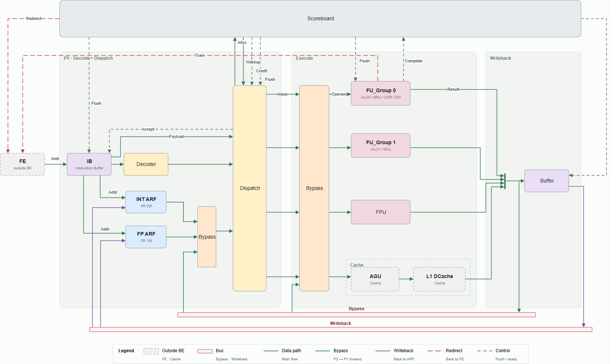

# Module: OR_BE Core Backend

## 1. Revision

| Revision | Change Note | Author | Date |
|---|---|---|---|
| V1.0 | Initial version | OR_BE team | 2026/09/29 |

## 2. Contents

- [Module: OR_BE Core Backend](#module-or_be-core-backend)
  - [1. Revision](#1-revision)
  - [2. Contents](#2-contents)
  - [3. Overview](#3-overview)
    - [3.1 Key Features](#31-key-features)
    - [3.2 Key Parameters](#32-key-parameters)
    - [3.3 Abbreviations](#33-abbreviations)
  - [4. Top-Level Block Diagram](#4-top-level-block-diagram)
  - [5. Pipeline Stages](#5-pipeline-stages)
  - [6. Sub-Modules](#6-sub-modules)
    - [6.1 backend_top](#61-backend_top)
    - [6.2 IB and Decode](#62-ib-and-decode)
    - [6.3 Rename and Dispatch](#63-rename-and-dispatch)
    - [6.4 Issue Queues](#64-issue-queues)
    - [6.5 Execution Units](#65-execution-units)
    - [6.6 Writeback Arbitration](#66-writeback-arbitration)
    - [6.7 Completion and Commit](#67-completion-and-commit)
    - [6.8 System Instructions and Serialization](#68-system-instructions-and-serialization)

## 3. Overview

OR_BE is the out-of-order execution backend of the processor core. The upstream frontend delivers up to two fetched instructions per cycle (with PC, raw encoding, RVC-expanded encoding, RVC-illegal flag, register indices and source/destination attributes, prediction information, and fetch exception). RVC expansion and operand extraction are done in the frontend; the backend performs full decode, tracks dependencies by tag, and dispatches instructions to the single-entry issue queues of four execution groups. Each group executes and writes back out of order, and results wake up waiting consumers over four bypass lanes. Memory accesses are handed by G3 through `g3_lsu_iface` to the external LSU.

Architectural state advances only at the commit point: register values, CSRs and privilege level are all updated at in-order commit. Branch mispredictions, exceptions, interrupts, xRET and FENCE.I are all resolved at the commit boundary; a single `global_flush_late` clears all speculative state and redirects the frontend.

### 3.1 Key Features

- Decode inside the backend: the 8-entry `IB` buffers frontend instructions, and `decode` performs full decode in P1 (RVC expansion is in the frontend)
- Up to 2 in-order dispatches per cycle: slot1 can be dispatched only if slot0 is accepted
- Four execution groups, one writeback lane per group: G0 ALU0/BRU, CSR, DIV; G1 ALU1, MUL; G2 FPU; G3 LSU
- One single-entry issue queue per group, with tag-based wakeup over four bypass lanes
- 16-entry in-flight window; the tag is the window index. Control state, result data and instruction PC are held by `CompletionScoreboard`, `Buffer` and `PC_File` respectively
- Renaming records producers only: one `{busy, tag}` map table each for INT and FP, no physical register file; architectural values live only in `INT_ARF` / `FP_ARF`
- P1 cannot read `Buffer` by tag and only sees the head0 / head1 data committing in the current cycle: a source whose producer has finished execution but not yet committed, and which is neither committing nor on a bypass lane in the current cycle, cannot dispatch until the producer commits (missed-wakeup stall)
- Up to 2 in-order commits per cycle; all recovery events are resolved at the commit boundary
- Serializing instructions (CSR, xRET, SFENCE.VMA, FENCE / FENCE.I, atomics) dispatch only in slot0 and only when the window is empty, and block all subsequent dispatch while in flight
- Store memory writes are non-speculative: a store may be sent to the LSU early, but is authorized only after all older instructions that may flush are safely resolved. Authorization obtained at allocation or while resident in `ISQ_Group3` is carried with the issue; authorization obtained after the store has been sent to the LSU is delivered by store wakeup
- ISA is RV64IMAFDC + Zcb with M/S/U privilege levels; `satp.MODE` is writable as Bare/Sv39/Sv48 (WARL). The backend only holds this state; address translation is done by the external memory side
- Branch outcomes update the frontend predictor directly after BRU execution, without waiting for commit

### 3.2 Key Parameters

| Parameter | Value | Description |
|---|---:|---|
| `XLEN` | 64 | Integer datapath width |
| `FLEN` | 64 | Floating-point datapath width |
| `ISSUE_WIDTH` | 2 | Dispatch width per cycle, also the commit width |
| `NUM_LANES` | 4 | Number of execution groups, also the number of writeback / bypass lanes |
| `ROB_DEPTH` | 16 | In-flight window entries (`CompletionScoreboard` / `Buffer` / `PC_File`) |
| `TAG_W` | 4 | In-flight instruction tag width |
| `IB_DEPTH` | 8 | `IB` entries |
| `NUM_GPR` / `NUM_FPR` | 32 / 32 | INT / FP architectural registers |
| `INT_SRC_PER_SLOT` | 2 | Integer sources per slot; `INT_ARF` and `INT_tag_mapping` have 4 read ports in total |
| `FP_READ_PORTS` | 3 | Read ports of `FP_ARF` and `FP_tag_mapping` (shared by both slots) |
| `G0_NUM_FU` / `G1_NUM_FU` / `G2_NUM_FU` | 3 / 2 / 1 | FUs in G0 / G1 / G2 |

### 3.3 Abbreviations

| Term | Meaning |
|---|---|
| ARF | Architectural Register File |
| BRU | Branch Resolution Unit |
| CSR | Control and Status Register |
| FU | Functional Unit |
| IB | Instruction Buffer |
| ISQ | Issue Queue |
| LSU | Load/Store Unit |
| RVC | RISC-V Compressed instruction |
| WB | Writeback |

## 4. Top-Level Block Diagram

## 5. Pipeline Stages

| Stage | Name | Main Function | Owning Modules |
|---|---|---|---|
| P0 | Frontend boundary | Accept frontend instructions into IB and return ready to the frontend | `IB` (→ [6.2](#62-ib-and-decode)) |
| P1 | Decode / rename / dispatch | Decode the two head instructions, resolve source operands, allocate tags and rename, decide admission and target group, write into ISQ | `decode`, `dependency_check`, `dispatch_logic`, `INT_tag_mapping` / `FP_tag_mapping`, `INT_ARF` / `FP_ARF`, `isq_payload_assembly` (→ [6.2](#62-ib-and-decode), [6.3](#63-rename-and-dispatch)) |
| P2 | Issue / execute | Each group's ISQ waits for operands to be ready and issues to an FU in the group; G3 issues to the external LSU | `ISQ_Group0`–`ISQ_Group3`, FUs, `g3_lsu_iface` (→ [6.4](#64-issue-queues), [6.5](#65-execution-units)) |
| P3 | Writeback / bypass | Arbitrate completion requests within a group; each group's lane writes `CompletionScoreboard` / `Buffer` and broadcasts bypass at the same time | `p3_arbiter_G0` / `p3_arbiter_G1`; G2 and G3 drive their lanes directly (→ [6.6](#66-writeback-arbitration)) |
| P4 | Commit / recovery | Commit in order to update architectural state, or select a recovery event at the commit boundary and broadcast flush | `CompletionScoreboard`, `Buffer`, `PC_File`, `flush_model`, `SerialInstructionTracker`, `system_instruction_handler` (→ [6.7](#67-completion-and-commit), [6.8](#68-system-instructions-and-serialization)) |

P1 holds no instruction state: accepted instructions enter the ISQ and the in-flight window, and unaccepted ones stay in IB. Speculation extends up to P4; no stage before P4 changes architectural state.

## 6. Sub-Modules

Each sub-module lists only its responsibility, the state it holds and its main upstream/downstream; behavior, interfaces and timing are defined by the linked module documents. The event / static-information classification of each module's ports is in [interface_definitions.md](../modules/interface_definitions.md). Pure selection muxes ([FP_read_address_mux](../modules/p1/FP_read_address_mux.md), [p1_ISQ_input_mux](../modules/p1/p1_ISQ_input_mux.md), [FU_input_mux](../modules/p2p3/FU_input_mux.md)) are not listed as sub-modules; `FU_input_mux` is instantiated inside each ISQ, one per source.

### 6.1 backend_top

**`backend_top`** ([backend_top.md](../modules/top/backend_top.md))

- Responsibility: backend top level; instantiates all sub-modules (33 instances in total) and wires them by P0–P4 and cross-stage Integration. Apart from field extraction and per-group aggregation of lanes / requests / ready, it only produces the gated operand information `opnd_g`: when `decode` flags an instruction illegal (including fetch exceptions), the source/destination use bits and FP attributes of the IB head `opnd` are cleared; register indices and `is_fp_opcode` are not gated.
- State: none.
- External boundary:
  - Frontend: instruction input `fe_valid` / `fe_instr_pld` and `fe_ready`; redirect (`redirect_valid` / `redirect_pc` / `redirect_kind`, plus `frontend_icache_invalidate` for FENCE.I); predictor update `predictor_update_*`.
  - LSU: issue (`be_lsu_issue_valid` / `be_lsu_issue_pld` and `lsu_be_issue_ready`); tagless `be_lsu_store_wakeup_valid`; final writeback (`lsu_be_done_*`, `lsu_be_exception_*`) and load-side `lsu_be_bypass_*`; result-channel acknowledgement `be_lsu_entry_ready`; `global_flush_late`.
  - Interrupt levels `mip_meip` / `mip_mtip` / `mip_msip`.

### 6.2 IB and Decode

**`IB`** ([IB.md](../modules/p1/IB.md))

- Responsibility: 8-entry in-order instruction FIFO. The frontend writes up to 2 per cycle (slot1 enqueues only if slot0 enqueues in the same cycle). `fe_ready` is given from the free space counting same-cycle dequeues, and is 0 in a flush cycle. The two head entries are exposed combinationally to P1 and dequeued by `ib_dequeue`; `global_flush_late` empties it.
- State: read/write pointers and a per-entry instruction payload (294 bit, containing PC, raw encoding, frontend-expanded encoding, RVC-illegal flag, register indices and source/destination attributes `opnd`, prediction information and fetch exception).
- Upstream/downstream: frontend → `IB` → `decode`, `dependency_check` (head valid bits, register indices, `is_fp_opcode`), read addresses of ARF and tag_mapping (FP via `FP_read_address_mux`), `isq_payload_assembly`, `PC_File` (PC write), `CompletionScoreboard` (destination register).

**`decode`** ([decode.md](../modules/p1/decode.md))

- Responsibility: purely combinational full decode. From the encoding already expanded by the frontend (compressed instructions additionally use the raw encoding to determine the sub-operation), it produces `exe_subop`, immediate, `mem_funct3`, serializing / store / FP attributes, CSR address and write intent, and static rounding mode. Unsupported encodings, disabled extensions, reserved rm, RVC-illegal reported by the frontend and fetch exceptions are all uniformly marked illegal; in that case all other decode fields are 0, and the instruction is rerouted to G0 to retire as an exception. The output `decoded_info_t` is 112 bit and contains no register indices or source/destination attributes; these come from the IB head `opnd`. When illegal, `backend_top` clears only the source/destination use bits and FP attributes; register indices are not gated.
- State: none.
- Upstream/downstream: `IB` → `decode` → `dependency_check` (serializing attribute), `dispatch_logic`, `isq_payload_assembly`, `CompletionScoreboard` (store attribute), and the `opnd_g` gating in `backend_top`.

### 6.3 Rename and Dispatch

**`dependency_check`** ([dependency_check.md](../modules/p1/dependency_check.md))

- Responsibility: purely combinational dependency resolution. Allocates consecutive `self_tag`s for the two slots starting at the `CompletionScoreboard` tail and gives `rd_write_enable` (integer x0 is not written). Using tag_mapping, it decides for each source whether it is ready (data from ARF, same-cycle commit or same-cycle bypass) or must wait for a producer tag, and handles same-cycle slot0→slot1 RAW. If the producer has finished execution but not yet committed, it reports a missed wakeup. rs3 is always treated as an FP source.
- State: none.
- Upstream/downstream: `IB` (head valid bits, register indices, `is_fp_opcode`), `opnd_g` (source/destination attributes), `decode` (serializing attribute), tag_mapping, `CompletionScoreboard` (tail, valid / exec_done bitmaps), bypass, commit → `dependency_check` → `dispatch_logic` (forwarded slot valid bits, serializing bits and `is_fp_opcode`, plus `slot_missed_wakeup`, `self_tag[0]`), `isq_payload_assembly` (`rsX_ready`, `rsX_wait_tag`, `rs_data_sel_t`), and the allocation fields of tag_mapping, `CompletionScoreboard` and `PC_File` (`self_tag`, `rd_write_enable`).

**`dispatch_logic`** ([dispatch_logic.md](../modules/p1/dispatch_logic.md))

- Responsibility: purely combinational dispatch admission and group selection.
  - Group selection by sub-operation class: ALU class prefers G0, and goes to G1 when G0 is not free (or already taken by slot0 in the same cycle) (AUIPC goes to G0 only); MUL goes to G1; FPU to G2; memory, atomics and FENCE / FENCE.I to G3; BRU, CSR, DIV, system-class and illegal instructions to G0. It also gives the FU index within the group.
  - Dynamic FP legality check: FP instructions (including FP load/store) are illegal when `FS` is Off; for operations using rm, a reserved rm value, or rm = DYN with frm reserved or DYN, is also illegal. Illegal instructions are rerouted to G0 and retire with an illegal-instruction exception.
  - Admission conditions: slot valid, sub-operation routable (not unsupported), window has capacity, target ISQ free, no serializing instruction in flight, window empty for a serializing instruction, no missed wakeup, not a flush cycle.
  - slot1 additionally requires: slot0 accepted, at least 2 free window entries, the two go to different groups, not both FP-opcode instructions (judged by `is_fp_opcode` without illegal gating), neither is a serializing instruction.
- State: none.
- Upstream/downstream: `dependency_check` (slot valid bits, serializing bits, `is_fp_opcode`, `slot_missed_wakeup`, `self_tag[0]`), `decode` (`exe_subop`, `full_decode`, FP attributes), `CompletionScoreboard` (capacity, window empty), ISQ free signals, `SerialInstructionTracker`, `system_instruction_handler` (`fs_enabled`, `frm`) → `dispatch_logic` → `accept` (i.e. `IB`'s `ib_dequeue`, which also drives allocation in `CompletionScoreboard`, `PC_File` and tag_mapping), ISQ write enables and payload selection, in-group FU index `slot_FU_Group`, `serial_set`, `effective_rm`, and allocation attributes `is_fence_i`, `may_flush`, `is_atomic`.

**`INT_tag_mapping` / `FP_tag_mapping`** ([INT_tag_mapping.md](../modules/p1/INT_tag_mapping.md), [FP_tag_mapping.md](../modules/p1/FP_tag_mapping.md))

- Responsibility: 32 entries of `{busy, tag}` recording the latest in-flight producer of each architectural register. On `accept`, busy is set and the tag written; on commit, busy is cleared only if the tag matches, protecting younger WAW mappings; on flush, all busy bits are cleared. The INT table has 4 read ports and x0 is never busy; the FP table has 3 read ports shared by both slots.
- State: busy and tag per entry.
- Upstream/downstream: IB head `opnd` (read addresses, allocated rd) / `dependency_check` (`rd_write_enable`, `self_tag`) / `accept` / commit / flush → tag_mapping → `dependency_check`. FP table read addresses come from `FP_read_address_mux` (slot0's indices if slot0 is an FP opcode, otherwise slot1's).

**`INT_ARF` / `FP_ARF`** ([INT_ARF.md](../modules/p1/INT_ARF.md), [FP_ARF.md](../modules/p1/FP_ARF.md))

- Responsibility: 32×64-bit architectural register values, written only by commit. Combinational read with no read/write bypass; values committing in the same cycle are provided to P1 separately by the commit datapath. INT reads of x0 are always 0; FP read addresses come from `FP_read_address_mux`.
- State: register values.
- Upstream/downstream: commit (`CompletionScoreboard` + `Buffer`) → ARF → `isq_payload_assembly`.

**`isq_payload_assembly`** ([isq_payload_assembly.md](../modules/top/isq_payload_assembly.md))

- Responsibility: purely combinational assembly. According to the data-source selection from `dependency_check`, takes ready operands from ARF, commit data or bypass, and combines them with IB fields, decode fields, `opnd_g`, `self_tag`, in-group FU index and `effective_rm` (overriding `full_decode.rm`) into the full ISQ payload (556 bit), one per slot.
- State: none.
- Upstream/downstream: `IB`, `decode`, `backend_top` (`opnd_g`), `dependency_check`, ARF, commit, bypass, `dispatch_logic` → `p1_ISQ_input_mux` → group ISQs.

### 6.4 Issue Queues

**`ISQ_Group0` / `ISQ_Group1` / `ISQ_Group2` / `ISQ_Group3`** ([ISQ_Group0.md](../modules/p2p3/ISQ_Group0.md), [ISQ_Group1.md](../modules/p2p3/ISQ_Group1.md), [ISQ_Group2.md](../modules/p2p3/ISQ_Group2.md), [ISQ_Group3.md](../modules/p2p3/ISQ_Group3.md))

- Responsibility: one single-entry issue queue per group, written at dispatch. Unready sources snoop the four bypass lanes and capture data on a hit; in the hit cycle the instruction can already issue with bypass data through `FU_input_mux`. It issues when all sources are ready and the selected FU is ready: the external `issue_valid` means request only (sources ready and not a flush cycle) and does not include `FU_ready`; the FU accepts when `issue_valid` and its own `FU_ready` hold together, and only then does the ISQ release the entry. The free signal `isq_free_for_dispatch` already accounts for same-cycle issue, so an old instruction can issue and a new one be written in the same cycle. Flush empties it.
- Per-group differences:
  - G0 selects ALU0/BRU, CSR or DIV by in-group FU index; G1 selects ALU1 or MUL.
  - G2 has 3 sources (rs3 is always an FP source; the INT / FP origin of rs1 / rs2 is chosen in P1 by `rs*_is_fp`).
  - G3 issues to `g3_lsu_iface`, whose `FU_ready` is given by `g3_lsu_iface`; it also reports the resident instruction's `self_tag` and occupancy bit `isq_occupied` to `CompletionScoreboard` for store authorization.
- State: one instruction payload, valid bit and per-source ready state.
- Upstream/downstream: `dispatch_logic` / `isq_payload_assembly` → ISQ → in-group FUs; bypass → ISQ; `isq_free_for_dispatch` → `dispatch_logic`.

### 6.5 Execution Units

| Group | WB Lane | FU Members | Lane Selection | Notes |
|---|---|---|---|---|
| G0 | 0 | ALU0/BRU (`alu_simple`), CSR (`csr_unit`), DIV (`div_simple`) | `p3_arbiter_G0`, priority ALU0/BRU > CSR > DIV | Takes branches, system instructions, illegal instructions and fetch exceptions; the only lane with CSR sideband; predictor updates are sent from here |
| G1 | 1 | ALU1 (`alu_simple`), MUL (`mul_simple`) | `p3_arbiter_G1`, priority ALU1 > MUL | Produces no exceptions, so instructions that may trap are never sent to G1 |
| G2 | 2 | FPU (`fpu_simple`) | Direct | Carries fflags on completion |
| G3 | 3 | `g3_lsu_iface` → external LSU | Direct | Load, store, atomics, FENCE / FENCE.I |

**`alu_simple`** ([alu_simple.md](../modules/fu/alu_simple.md))

- Responsibility: single-cycle integer ALU, instantiated twice. The result is registered for one cycle, then a completion request is raised and held until arbitration succeeds. G0's ALU0/BRU additionally handles:
  - branch and jump resolution, producing the mispredict flag and target PC;
  - system-class sub-operations (privilege legality of ECALL, EBREAK, xRET, WFI, SFENCE.VMA, including `mstatus.TSR` trapping S-mode SRET, `TW` trapping lower-privilege WFI, `TVM` trapping S-mode SFENCE.VMA); legal WFI and SFENCE.VMA complete normally only and do not trigger a redirect;
  - producing cause / tval for illegal instructions, fetch exceptions, ECALL and EBREAK;
  - sending the predictor update directly to the frontend one cycle after execution, bypassing arbitration.

  G1's ALU1 only receives pure arithmetic sub-operations routed by dispatch, so it produces no mispredicts, exceptions or xRET.
- State: one completion request pending arbitration; BRU additionally holds one predictor update.
- Upstream/downstream: ISQ → FU → group arbiter; privilege state from `system_instruction_handler` → ALU0/BRU; ALU0/BRU → frontend (predictor update).

**`csr_unit`** ([csr_unit.md](../modules/fu/csr_unit.md))

- Responsibility: CSR execution. In the issue cycle it reads the old CSR value provided by `system_instruction_handler`, checks whether the address is implemented, privilege, TVM and FS legality, and writes to read-only CSRs, computes the rd writeback result and the CSR write data, registers them and raises a completion request held until arbitration succeeds. The CSR write intent is passed through the G0 arbiter's CSR sideband to `system_instruction_handler`, which stages it; it takes effect only at commit.
- State: one completion request pending arbitration.
- Upstream/downstream: `ISQ_Group0` → `csr_unit` → `p3_arbiter_G0`; `system_instruction_handler` ↔ `csr_unit` (CSR address and old value, privilege level, TVM, FS state).

**`div_simple` / `mul_simple`** ([div_simple.md](../modules/fu/div_simple.md), [mul_simple.md](../modules/fu/mul_simple.md))

- Responsibility: multi-cycle integer divide / remainder (G0) and multiply (G1), both with a fixed countdown. After completion the request is held until arbitration succeeds, and no new issue is accepted meanwhile.
- State: execution countdown and result.
- Upstream/downstream: ISQ → FU → group arbiter.

**`fpu_simple`** ([fpu_simple.md](../modules/fu/fpu_simple.md))

- Responsibility: RV64FD floating-point execution. Computes combinationally, registers for one cycle, then publishes writeback and bypass together; G2 has no arbiter. `FU_ready` is 0 in the cycle after issue. Uses the `effective_rm` snapshotted at dispatch; fflags are sent with completion.
- State: one registered completion result.
- Upstream/downstream: `ISQ_Group2` → `fpu_simple` → lane 2.

**`g3_lsu_iface`** ([g3_lsu_iface.md](../modules/lsu/g3_lsu_iface.md))

- Responsibility: bridge between G3 and the external LSU.
  - Converts `ISQ_Group3` issues into LSU issues and records in-flight requests by tag; the `FU_ready` given to `ISQ_Group3` requires that the tag is not in flight and that the LSU asserts `lsu_be_issue_ready`.
  - Store authorization: at issue, reads the `CompletionScoreboard` authorization bit `st_br_resolve` (valid for plain stores only) and sends it with the LSU issue; for stores already sent to the LSU, converts the tagged `store_wakeup_valid` into the tagless `be_lsu_store_wakeup_valid` on the LSU boundary. If the wakeup arrives before the target store has been sent to the LSU, the authorization is held pending and delivered in the cycle that store issues; this is a fallback path and unreachable in normal operation. At most one authorization is pending at a time.
  - Merges the LSU load-side bypass and final writeback (done / exception) into lane 3's completion and bypass; `be_lsu_entry_ready` is always 1 except in reset and flush cycles.
  - On flush, clears all bridge state and discards final results arriving in that cycle.
- State: per-tag in-flight, authorization-pending, load-complete and done flags, plus staged load data.
- Upstream/downstream: `ISQ_Group3`, `CompletionScoreboard` → `g3_lsu_iface` ↔ external LSU; `g3_lsu_iface` → lane 3.

### 6.6 Writeback Arbitration

**`p3_arbiter_G0` / `p3_arbiter_G1`** ([p3_arbiter_G0.md](../modules/p2p3/p3_arbiter_G0.md), [p3_arbiter_G1.md](../modules/p2p3/p3_arbiter_G1.md))

- Responsibility: stateless fixed-priority arbitration. Each cycle it selects one completion request in the group as the group lane's writeback and bypass; bypass is valid only if the winner has no exception. The winner gets a grant and losers get a hold; losers keep their requests and stop accepting new issues. `p3_arbiter_G0` also sends the winning CSR result to `system_instruction_handler` as the CSR sideband. The arbiter only forwards the winner's fields; fields that are always 0 within the group are driven by the FUs themselves. G2 and G3 each have a single source and drive their lanes directly without an arbiter.
- State: none.
- Upstream/downstream: in-group FUs → arbiter → lane writeback (`CompletionScoreboard` records events, `Buffer` stores data) and lane bypass (four ISQs, `dependency_check`, `isq_payload_assembly`).

### 6.7 Completion and Commit

**`CompletionScoreboard`** ([CompletionScoreboard.md](../modules/p4/CompletionScoreboard.md))

- Responsibility: the retirement-side resolution hub, managing the 16-entry circular in-flight window.
  - At dispatch, allocates by `accept` and records the destination register plus store, atomic, FENCE.I and `may_flush` attributes.
  - At writeback, records execution completion, along with exception, mispredict and xRET events and the corresponding cause / tval / target PC / fflags; writebacks in a flush cycle are not recorded.
  - Each cycle resolves from the head: commits 0–2 instructions in order, and may select one recovery event in the same cycle for `flush_model`. Resolution happens only when head0 has finished execution. Recovery priority is head0 exception > interrupt > head0 xRET, FENCE.I or mispredict. Exceptions and interrupts do not commit head0; xRET, FENCE.I and mispredict commit head0 and recover in the same cycle. On an interrupt, if head0 is a completed, exception-free store / atomic, head0 is committed first and the interrupt is taken at head1 (requires head1 valid); otherwise the interrupt is taken at head0. head1 is evaluated only after head0 commits normally (a head1 exception recovers at head1; FENCE.I or mispredict commits head1 and recovers in the same cycle). When both write an FP destination register, only head0 commits. On recovery, tail rolls back to the post-commit head.
  - Store authorization: a plain store is authorized once all older instructions that may flush are safely resolved. If the prefix is already all safe at allocation, the authorization bit is recorded directly; otherwise the oldest unauthorized store is authorized when the condition is met, there is no recovery in the cycle, and the store has no writeback in that cycle: if it is still resident in `ISQ_Group3`, the authorization bit is recorded in place and read by `g3_lsu_iface` at issue; if already sent to the LSU, `g3_lsu_iface` is notified with `store_wakeup_valid` (tagged).
  - Interrupts are not taken while there is still an authorized but uncommitted store.
- State: head / tail pointers; per-entry execution-complete, authorized, wakeup-sent, attributes and event records.
- Upstream/downstream: P1 modules such as `dispatch_logic` (allocation), `ISQ_Group3` (`self_tag`, `isq_occupied`), lane writeback, `system_instruction_handler` (`interrupt_pending`) → `CompletionScoreboard` → commit events (`INT_ARF` / `FP_ARF`, tag_mapping, `SerialInstructionTracker`, `system_instruction_handler`, `dependency_check`, and the `Buffer` read address), `flush_model` and `PC_File` (`flush_tag`), `g3_lsu_iface`; window capacity, tail and valid / exec_done bitmaps → `dispatch_logic`, `dependency_check`.

**`Buffer`** ([Buffer.md](../modules/p4/Buffer.md))

- Responsibility: 16×64-bit result storage, written by tag from the 4 lanes and read by the head0 / head1 tags as commit data. Not connected to flush; window validity is determined by `CompletionScoreboard`.
- State: per-entry result data.
- Upstream/downstream: lane writeback → `Buffer` → commit data (ARF, `isq_payload_assembly`).

**`PC_File`** ([PC_File.md](../modules/p4/PC_File.md))

- Responsibility: 16×64-bit instruction PC storage, written by `self_tag` at dispatch. One recovery read port (indexed by `CompletionScoreboard`'s `flush_tag`) feeds `flush_model` as the base for EPC and FENCE.I.
- State: per-entry instruction PC.
- Upstream/downstream: `IB` / `accept` (write), `CompletionScoreboard` (`flush_tag`) → `PC_File` → `flush_model`.

**`flush_model`** ([flush_model.md](../modules/p4/flush_model.md))

- Responsibility: stateless recovery exit. There are six `recovery_kind`s: MISPREDICT, EXCEPTION, MRET, INTERRUPT, FENCE_I, SRET (encodings 0–5, 6–7 reserved), all of which redirect the frontend. The redirect PC is selected by `recovery_kind`: mispredict target, `mepc`, `sepc`, the next instruction after FENCE.I (PC + 4), or the trap vector (queried from `system_instruction_handler` with cause and interrupt flag). In the same cycle it issues `global_flush_late`, the frontend redirect (plus icache invalidation for FENCE.I), and the trap / xRET state-write packet `trap_state_write` to `system_instruction_handler` (EXCEPTION, INTERRUPT, MRET, SRET).
- State: none.
- Upstream/downstream: `CompletionScoreboard`, `PC_File`, `system_instruction_handler` → `flush_model` → frontend, `system_instruction_handler`, and the backend-wide flush broadcast.

### 6.8 System Instructions and Serialization

**`SerialInstructionTracker`** ([SerialInstructionTracker.md](../modules/p4/SerialInstructionTracker.md))

- Responsibility: records the single in-flight serializing instruction. Set when a serializing instruction is accepted; cleared when the instruction with the same tag commits or on flush. While set, `dispatch_logic` dispatches nothing.
- State: one valid bit and one tag.
- Upstream/downstream: `dispatch_logic` (`serial_set`), commit, flush → `SerialInstructionTracker` → `dispatch_logic` (`serial_inflight_valid`).

**`system_instruction_handler`** ([system_instruction_handler.md](../modules/p4/system_instruction_handler.md))

- Responsibility: sole owner of architectural CSRs and privilege state, including `mstatus`, interrupt enable and pending, trap vectors, EPC, cause, tval, scratch, delegation, `satp`, counters, `fflags`, `frm`, and the current privilege level.
  - CSR write: a single staging entry captures G0's CSR sideband and writes it when the corresponding tag commits; on flush it is simply discarded, since architectural CSRs are never written during speculation and nothing needs to be rolled back.
  - Performs trap entry (delegated to S when taken from a non-M mode and the corresponding `medeleg` / `mideleg` bit is set) and MRET / SRET return according to the state-write packet from `flush_model`.
  - Implements M/S/U and resets in M mode. `mstatus.MPP` is WARL-clamped to implemented privilege levels; in `mip` only SSIP has storage, and MEIP/MTIP/MSIP are views of external levels; the MODE of `mtvec` / `stvec` accepts Direct / Vectored as WARL, with Vectored applying to interrupts only; `satp.MODE` accepts Bare / Sv39 / Sv48 as WARL, and writes with any other MODE leave the whole register unchanged.
  - Accumulates fflags at commit. FS is set to Dirty when a retiring instruction writes an FP destination register or has non-zero fflags; CSR instructions writing `fflags` / `frm` / `fcsr` also set Dirty at commit.
  - Provides CSR read ports, the current privilege level, `mstatus.TVM/TW/TSR`, FP control (`frm`, `fs_enabled`), `mepc` / `sepc`, the trap vector, and the interrupt request `interrupt_pending` with interrupt cause.
- State: all architectural CSRs, the current privilege level, one staged CSR write.
- Upstream/downstream: `p3_arbiter_G0` (CSR sideband), commit, `flush_model`, `mip_*` → `system_instruction_handler` → `csr_unit`, ALU0/BRU, `dispatch_logic`, `CompletionScoreboard`, `flush_model`.
