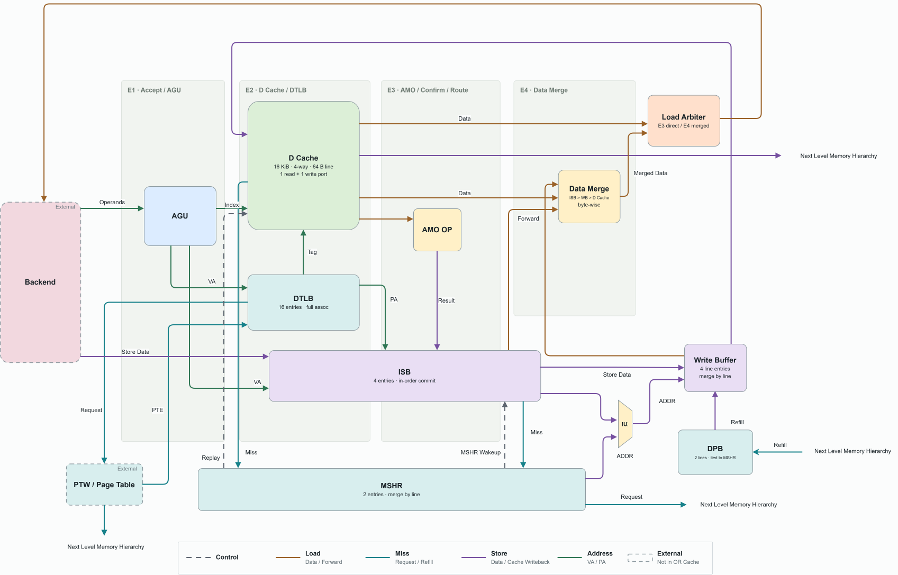

# Module: OR_Cache L1 Data Cache / LSU

## 1. Revision

| Revision | Change Note | Author | Date |
|---|---|---|---|
| V1.0 | Initial version (corresponding to architecture spec v5 / RTL R3) | OR_Cache team | 2026/09/29 |

## 2. Contents

- [Module: OR\_Cache L1 Data Cache / LSU](#module-or_cache-l1-data-cache--lsu)
  - [1. Revision](#1-revision)
  - [2. Contents](#2-contents)
  - [3. Overview](#3-overview)
    - [3.1 Key Features](#31-key-features)
    - [3.2 Key Parameters](#32-key-parameters)
    - [3.3 Abbreviations](#33-abbreviations)
  - [4. Top-Level Block Diagram](#4-top-level-block-diagram)
  - [5. Pipeline Stages](#5-pipeline-stages)
  - [6. Sub-Modules](#6-sub-modules)
    - [6.1 or\_cache\_top](#61-or_cache_top)
    - [6.2 Address Generation and Translation](#62-address-generation-and-translation)
    - [6.3 D Cache](#63-d-cache)
    - [6.4 Store Buffer and Atomics](#64-store-buffer-and-atomics)
    - [6.5 Miss Handling](#65-miss-handling)
    - [6.6 L1 Write Buffer](#66-l1-write-buffer)
    - [6.7 Load Data Return](#67-load-data-return)
    - [6.8 Flush and Translation Context](#68-flush-and-translation-context)

## 3. Overview

OR_Cache is the memory unit of OR_BE: an L1 data cache (write-back, write-allocate) together with a store buffer, miss handling, and address translation. Through `lsu_bridge`, BE supplies at most one memory request per cycle from G3, in program order. OR_Cache computes the address, probes the DTLB, reads the D cache, performs store-to-load forwarding, executes AMO and LR/SC, and returns the terminal state of each request (done / exception, with bypass on the load side) to BE. On the write side, a store, a successful SC, or an AMO is handed from the ISB to the L1 Write Buffer after authorization and then written into the D cache, producing an architectural state change. Lower-level memory access and page-table walking are outside OR_Cache.

### 3.1 Key Features

- The subsystem accepts one memory request per cycle, and the read side never rejects a request. The only backpressure condition is a full store buffer (`lsu_store_buffer_full`).
- The design has four pipeline stages, E1–E4. Stages E2–E4 never stall. A request that must wait or that encounters a miss enters MissQ and is replayed from E1 once its waiting condition is satisfied.
- A D-cache hit that needs no merge returns in two cycles through the Load Data Arbiter. A load that requires ISB / WB merging returns in three cycles through E4 Data Merge.
- The cache is 16 KiB, four-way set associative, and uses 64-byte lines and VIPT indexing (the page offset covers both the index and line offset, so there are no aliases). It uses write-back and write-allocate policies, tree-PLRU replacement, one data read port, and one write port. The ISB head also has a separate read-only tag lookup port.
- Store-to-load forwarding uses two comparison levels. In E2, the subsystem performs a byte-granular pre-filter on the VA page offset. In E3, it performs exact confirmation using the PA page number. For each byte, the youngest older store is selected, with data priority ISB > WB > D cache.
- The four-entry ISB commits stores in program order. After the head is authorized, the ISB determines whether the access hits or misses. A hit is sent to WB, while a miss is registered with the MSHR and retains its data in the ISB. During refill, the data enters WB together with the DPB line. A miss at the head blocks younger stores.
- The L1 Write Buffer stores entries by line (line address, 64 bytes of data, and byte mask). It merges entries for the same line, keeps line addresses unique, and provides forwarding to loads.
- The MSHR is a single module with two entries that support same-line merging; each entry is paired one-to-one with a DPB entry. When the MSHR install notification arrives and is accepted by WB for a store miss, the ISB store-commits data and merges with the DPB line in WB, then releases the ISB entry. After WB writes the install entry into the D cache, it generates the MSHR completion event and releases the corresponding MSHR entry. Load/AMO requests already waiting in MissQ for that entry are awakened and replayed by the same completion event.
- The DTLB has 16 fully associative entries and caches permitted read and write permissions. The subsystem also performs PMA checking. Its two translation-miss-queue entries obtain page-table entries through the external PTW port. A CSR-context change or SFENCE.VMA invalidates the entire structure.
- Atomic operations are dispatched serially by BE: an AMO waits in E1 until both ISB and WB are empty (and there is no store-side request pending allocation in E2), reads the old value directly from the D cache, computes the new value in E3 through AMO OP, writes it back to the ISB, and then store-commits through the ordinary store path. LR/SC reservations are aligned one-for-one with the reference model.
- An unaligned ordinary access is split into two parts. If it crosses a page boundary, the two parts use separate translations. A naturally misaligned atomic operation raises an exception.
- Flush clears only uncommitted transactions. Committed writes, including WB writes, refills, and evictions, are not affected.

### 3.2 Key Parameters

| Parameter | Value | Description |
|---|---:|---|
| `XLEN` | 64 | Datapath width |
| `LSU_TAG_W` | 4 | Request-tag width. The frozen BE↔LSU interface supports at most 16 in-flight requests. |
| `ISB_N` | 4 | Number of store-buffer entries (= `LSU_STORE_BUFFER_DEPTH`, frozen interface) |
| `LSU_LOAD_PIPE_STAGES` | 2 | Direct load-hit latency in the frozen interface. A merged load takes 3 cycles. |
| `LINE_BYTES` | 64 | Cache-line size in bytes |
| `DC_SETS` / `DC_WAYS` | 64 / 4 | Number of sets / ways (16 KiB) |
| `PA_W` / `VPN_W` | 56 / 52 | Physical-address width / VPN comparison width (`VA[63:12]`) |
| `DTLB_N` / `TMQ_N` | 16 / 2 | DTLB entries / translation-miss-queue entries |
| `MSHR_N` | 2 | Number of MSHR entries (= number of DPB entries) |
| `MISSQ_N` | 16 | Replay-queue entries (= in-flight tag limit) |
| `WB_N` | 4 | L1 Write Buffer line entries (must be ≤ `DC_WAYS`) |
| `CDB_N` | 16 | Terminal-state FIFO entries (= in-flight tag limit) |

### 3.3 Abbreviations

| Term | Meaning |
|---|---|
| AGU | Address Generation Unit |
| AMO | Atomic Memory Operation |
| CDB | Terminal-state queue (Completion Data Buffer), presenting done / exception / bypass to BE |
| DPB | Data Pending Buffer, temporary storage for a refill line |
| DTLB | Data Translation Look-aside Buffer |
| ISB | Integrated Store Buffer |
| LDA | Load Data Arbiter |
| LR / SC | Load-Reserved / Store-Conditional |
| MissQ | Replay queue |
| MSHR | Miss Status Holding Register |
| PLRU | Pseudo Least Recently Used |
| PMA | Physical Memory Attributes |
| PTW | Page Table Walk (outside OR_Cache) |
| TMQ | Translation Miss Queue |
| VIPT | Virtually Indexed, Physically Tagged |
| WB | L1 Write Buffer (not the writeback buffer in this document) |

## 4. Top-Level Block Diagram

## 5. Pipeline Stages

| Stage | Name | Main Function | Owning Modules |
|---|---|---|---|
| E1 | Accept / AGU | The stage accepts BE requests and arbitrates the operation entering E2 in the current cycle, using the priority new issue > released AMO > MissQ replay. It computes the VA and splits accesses across lines. If ISB or WB is non-empty, or if a store-side request is pending allocation in E2, it places an AMO in the hold register. It also consumes the store-authorization slot and its O1 snapshot. | `dc_agu`, `or_cache_top` (arbitration, AMO hold), `dc_isb` (authorization) (→ [6.1](#61-or_cache_top), [6.2](#62-address-generation-and-translation), [6.4](#64-store-buffer-and-atomics)) |
| E2 | D cache / DTLB | The stage performs the DTLB lookup (PA, permissions, and PMA), produces the D-cache read/write-priority view, compares tags, and selects the 8 bytes from the hit way. It allocates a new store-side request in ISB and writes the store data and VA. On the read side, it performs the VA pre-filter. | `dc_dtlb`, `dc_l1d`, `dc_tag_compare`, `dc_isb` (→ [6.2](#62-address-generation-and-translation), [6.3](#63-d-cache), [6.4](#64-store-buffer-and-atomics)) |
| E3 | AMO / forwarding confirm / load route | The stage determines exceptions and writes the PA into ISB. On an AMO hit, it computes the new value with AMO OP and writes it back to ISB. It confirms the forwarding PA and WB matches, sampling them in this stage. It routes a direct load to LDA, a load needing a merge to E4, a wait / miss / TLB miss to MissQ (with MSHR / TMQ), and an exception / FENCE to CDB. It also creates the part1 replay for a direct split load and for part0 of a split store. | `or_cache_top` (routing), `dc_amo_op`, `dc_isb`, `dc_wb` (forwarding), `dc_mshr`, `dc_missq`, `dc_ld_arb` (→ [6.1](#61-or_cache_top), [6.4](#64-store-buffer-and-atomics), [6.5](#65-miss-handling), [6.7](#67-load-data-return)) |
| E4 | Data merge | The stage merges bytes in the order ISB > WB > D cache, concatenates bytes collected from split part0, and formats the result. It sends the result through LDA to CDB and rebuilds a part1 replay for split part0. | `dc_data_merge`, `dc_ld_arb`, `dc_missq` (→ [6.7](#67-load-data-return), [6.5](#65-miss-handling)) |

Each pipeline stage carries one operation, meaning one part for one pass, and does not retain request state. Waiting requests reside in MissQ, while store-side requests reside in ISB. ISB head store-commit, MSHR / DPB refill, WB write-out, and CDB presentation operate independently of the pipeline stages. Within the cache subsystem, architectural state advances only when the ISB store-commits on the write side; E1–E4 themselves do not change architectural state.

Regarding the E1 AMO hold and arbitration priority: BE guarantees that no younger instruction is dispatched while an AMO is in flight. Therefore, no other memory request arrives while the AMO is waiting in E1, so there is no possibility of deadlock caused by the AMO being unable to issue while a younger memory instruction is issued.

## 6. Sub-Modules

Each sub-module description states only its responsibility, owned state, and principal upstream/downstream connections. Behavior, interfaces, and timing are defined by the linked module documents. Shared parameters, types, and functions are defined in [OR_Cache_common.md](../uarch/OR_Cache_common.md).

### 6.1 or_cache_top

**`or_cache_top`** ([OR_Cache_top.md](../uarch/OR_Cache_top.md))

- **Responsibility:** OR_Cache integration layer. Instantiates all sub-modules and owns pipeline control: E1 arbitration and the AMO hold register, E1→E2→E3→E4 pipeline registers, E3 result routing (exactly one destination per operation), the O1 in-flight load set, and program sequence number `seq`.
- **State:** Per-stage `{valid, op}` registers, AMO hold register (op, rs2, authorization, O1 snapshot), in-flight load-side tag bitmap, and `seq`.
- **External boundary:** The frozen BE↔LSU interface provides issue, store wakeup, done, exception, bypass, `lsu_store_buffer_full`, and `global_flush_late`. The module also connects to the L2 refill request and response and to dirty-line eviction, the PTW request and response, and CSR context (`satp`, privilege level, SUM, MXR) plus `sfence_vma`. Verification uses the `ms_drain_*` model-synchronization observation ports for ISB store-commit.

### 6.2 Address Generation and Translation

**`dc_agu`** (OR_CACHE_AGU, [AGU.md](../uarch/AGU.md))

- **Responsibility:** This module is purely combinational in E1. For a new request, it computes `VA = imm_valid ? rs1 + imm : rs1`. For a replay or released AMO, it takes the original VA from the payload. It detects a line crossing and produces the starting VA and byte count for the current part; part1 recomputes these values from the original VA.
- **State:** None.
- **Upstream/downstream:** BE issue payload, MissQ, and AMO hold register → `dc_agu` → E2 register.

**`dc_dtlb`** (OR_CACHE_DTLB, [DTLB.md](../uarch/DTLB.md))

- **Responsibility:** In E2, perform a combinational VA→PA lookup (when paging is disabled, PA = VA), check cached read and write permissions for the access class, and check PMA. In E3, allocate or merge a translation-miss-queue entry for a miss. The module obtains a PTE through the PTW port and installs it, then broadcasts a response to wake MissQ waiters. On a context change or SFENCE.VMA, it invalidates the whole structure in the same cycle and advances the epoch. Stale responses are not installed.
- **State:** The DTLB contains sixteen entries `{valid, vpn, page size, ppn, r_ok, w_ok}`, a round-robin pointer, and an epoch. The TMQ contains two entries `{valid, vpn, epoch, sent}`.
- **Upstream/downstream:** E2 VA and `dc_flush_ctrl` (`vm_en`, invalidation) feed `dc_dtlb`. The DTLB sends PA to `dc_tag_compare` and sends PA, hit, and PMA error to E3. It communicates bidirectionally with the external PTW and sends wakeups and preloaded faults to `dc_missq`.

### 6.3 D Cache

**`dc_l1d`** (OR_CACHE_L1D, [L1D.md](../uarch/L1D.md))

- **Responsibility:** D-cache array and read/write ports.
  - One data read port (E2): The port uses the VA index to read valid / tag for every way in the set and extracts 8 bytes at the line offset for every way. The result is the write-priority view, so writes from this cycle, including install replacement, are already reflected.
  - Two tag lookup ports (for the two ISB-head parts): read-only valid / tag lookup.
  - One write port (driven by WB): The port performs byte writes (setting dirty) or whole-line installs. During an install, this module selects the victim. It first chooses an invalid non-excluded way, then the PLRU-selected way. If that way is excluded, it chooses the lowest-numbered non-excluded way. A dirty victim is written through `dc_evict_*` in the same cycle.
  - PLRU is updated by E3 hits and write-port activity.
- **State:** Tag / data / valid / dirty arrays (64 sets × 4 ways × 64 B), and 3-bit PLRU per set.
- **Upstream/downstream:** E2 address → read port → `dc_tag_compare`, E3; `dc_isb` → tag lookup ports; `dc_wb` → write port; `dc_l1d` → external eviction.

**`dc_tag_compare`** (OR_CACHE_TAG_COMPARE, [TAG_COMPARE.md](../uarch/TAG_COMPARE.md))

- **Responsibility:** Purely combinational in E2. Compare each way's tag with the PA tag from the DTLB and output the hit and hit-way number.
- **State:** None.
- **Upstream/downstream:** `dc_l1d` read port and `dc_dtlb` → `dc_tag_compare` → E3 registers.

### 6.4 Store Buffer and Atomics

**`dc_isb`** (OR_CACHE_ISB, [ISB.md](../uarch/ISB.md))

- **Responsibility:** Manage the complete lifecycle of store-side entries (STORE / AMO / SC) in a four-entry FIFO. Entries are allocated in program order.
  - **E1 authorization:** store wakeup targets the oldest unauthorized ordinary store (ISB entry → store pending allocation in E2 → early authorization slot).
  - **E2 allocation and E3 updates:** Write the store data and VA page offset in E2. Write the PA in E3. For an AMO, also write the result, including the new value and formatted old value.
  - **Forwarding:** Pre-filter by page offset in E2 and confirm by PA page number in E3. The module produces the byte mask / data, a wait signal, and the candidate flag (`fq_cand`). A load with a candidate cannot use the direct path.
  - **Head store-commit:** The entry must have no exception, be authorized, have complete PA, and have all older loads terminated (O1). An AMO additionally requires its result to be written back. For each part, `present = tag lookup hit ∨ WB has a same-line entry ∨ an MSHR is installing the same line this cycle`. If all parts are present and WB can accept this cycle, the ISB store-commits to WB, merging bytes from a same-cycle store-commit into the install entry. If a part is not present, the ISB registers it through MSHR port B and waits. A failed SC does not require `present` and completes without writing. Store-commit releases the entry, marks the model's `store_commit` point, and sends done through CDB. Younger stores never commit while the head has not committed.
  - **SC result and LR/SC reservation:** determine SC success and reservation state (an LR sets it on its acceptance cycle; each store-side commit clears it).
  - **`lsu_store_buffer_full`:** counts accepted but not-yet-allocated store-side requests.
- **State:** Each entry stores its tag, class, size, program sequence number, store data, VA page offset, two-part PA, authorization, fault, O1 set, MSHR wait, and AMO result. The module also stores read/write pointers, the early authorization slot, the reservation register, and the E2 pre-filter result register.
- **Upstream/downstream:** BE authorization and E1 / E2 / E3 feed `dc_isb`. The ISB sends store-commits to `dc_wb`, done to `dc_cdb`, port-B requests to `dc_mshr`, and forwarding information to E3. It also exchanges ISB-change wakeups with `dc_missq`, uses the `dc_l1d` tag lookup ports, and receives install notifications and completion events from `dc_mshr`.

**`dc_amo_op`** (OR_CACHE_AMO_OP, [AMO_OP.md](../uarch/AMO_OP.md))

- **Responsibility:** This module is purely combinational in E3. It computes the AMO new value from the old value read from the D cache and `rs2` from the ISB, then writes the new value back to the ISB. It formats the old value according to `funct3` as done data. The old value is taken directly from the D cache. The E1 AMO hold in `or_cache_top` guarantees that, when the AMO enters E2, both ISB and WB are empty and no older store-side request is pending in E2.
- **State:** None.
- **Upstream/downstream:** E3 (D-cache bytes, memop, funct3), `dc_isb` (`rs2`) → `dc_amo_op` → `dc_isb` (result writeback).

### 6.5 Miss Handling

**`dc_mshr`** (OR_CACHE_MSHR, [MSHR.md](../uarch/MSHR.md))

- **Responsibility:** Provide the control path for in-flight misses. Port A (an E3 load or AMO miss) and port B (an ISB-head store miss) merge requests by line address. Otherwise, they allocate a free entry. If all MSHR entries are occupied, the caller waits for an entry to be released. Each entry passes through four phases: request issue, response wait, data in DPB, and installation. The response writes the data to DPB. A normal load miss is installed in the D cache only through DPB and WB. For a store miss, the install notification causes the ISB to store-commit and merge its data with the DPB line in WB, after which the ISB entry is released. When WB writes the install entry into the D cache, it generates the MSHR completion event and releases the MSHR. A load or AMO request already waiting in MissQ for that MSHR is awakened and replayed by the same completion event.
- **State:** Two entries `{state, line address}`.
- **Upstream/downstream:** E3 and `dc_isb` feed `dc_mshr`, which communicates with the external L2. The MSHR sends install commands to `dc_dpb` and `dc_wb`, notifications and completion events to `dc_isb`, and completion events to `dc_missq`. `dc_wb` reports completed installation back to `dc_mshr`.

**`dc_dpb`** (OR_CACHE_DPB, [DPB.md](../uarch/DPB.md))

- **Responsibility:** This is the refill data path. `DPB[i]` belongs to `MSHR[i]`. The L2 response writes the line by ID, and installation reads the whole line using the MSHR-provided ID before sending it to WB.
- **State:** Two line-data entries.
- **Upstream/downstream:** External L2 response, `dc_mshr` → `dc_dpb` → `dc_wb`.

**`dc_missq`** (OR_CACHE_MISSQ, [MISSQ.md](../uarch/MISSQ.md))

- **Responsibility:** Operations awaiting replay and the reasons for waiting (DTLB miss, MSHR, or an older store PA / store-commit in ISB). The module wakes entries on the corresponding event, including a PTW response, DTLB invalidation, MSHR completion, or an ISB change. A fault reported by the PTW is stored in the corresponding payload when the entry is awakened and is reported as an exception when the request is replayed. Same-cycle wakeup is supported. The oldest ready entry is sent to E1 for replay. The module has two allocation ports, E3 and E4; E4 handles part1 of a merged split path. Flush clears the queue.
- **State:** Sixteen entries `{valid, operation payload, wait reason, wait object}`.
- **Upstream/downstream:** E3, E4 → `dc_missq` → E1; `dc_dtlb`, `dc_mshr`, `dc_isb` → `dc_missq` (wakeups).

### 6.6 L1 Write Buffer

**`dc_wb`** (OR_CACHE_L1_WRITE_BUFFER, [WB.md](../uarch/WB.md))

- **Responsibility:** D-cache write path.
  - Line-based FIFO (line address + 64-byte data + byte mask), merging same-line entries and keeping line addresses unique.
  - **Inputs:** MSHR refill-install entries contain the DPB line and store bytes from a same-cycle store-commit, merged before the line becomes dirty. ISB store parts either create a new entry with the ISB-found hit way or merge into an existing same-line entry. The WB does not merge into the entry being written out in the current cycle. A newly created entry with a specified way is not accepted when its set is also being installed in the current cycle.
    For a refill-install entry, the MSHR supplies the cache-line address (`inst_line`), while the DPB supplies the returned line data. For an ordinary store entry, the ISB supplies the line address and store bytes. For a store miss, WB uses the MSHR line address and merges the ISB store bytes into the DPB line.
  - **Write-out:** The head writes one D-cache update per cycle. A store entry writes its masked bytes to a known way. An install entry installs the whole line and passes the ways occupied by other WB store entries in the same set to the D cache as the victim exclusion set. The install write-out reports completion to the MSHR.
  - **Forwarding:** provide a byte mask / data by PA line address, sampled in E3.
  - It does not determine misses or request an MSHR.
- **State:** Four entries `{line address, line data, byte mask, install flag, way, dirty, owning MSHR}`, plus read/write pointers.
- **Upstream/downstream:** `dc_isb` (store-commit), `dc_mshr` / `dc_dpb` (install) → `dc_wb` → `dc_l1d` write port, `dc_mshr` (install written), E3 (forwarding), `dc_isb` (same-line presence).

### 6.7 Load Data Return

**`dc_data_merge`** (OR_CACHE_DATA_MERGE, [DATA_MERGE.md](../uarch/DATA_MERGE.md))

- **Responsibility:** Purely combinational in E4. Merge bytes in the order ISB > WB > D cache (ISB and WB data are selected using their respective masks), concatenate bytes already collected from split part0, and format by size / signedness / floating-point NaN-boxing.
- **State:** None.
- **Upstream/downstream:** E4 registers (D-cache bytes, ISB and WB forwarding sampled in E3) → `dc_data_merge` → `dc_ld_arb`, `dc_missq` (part1).

**`dc_ld_arb`** (OR_CACHE_LOAD_DATA_ARBITER, [LD_ARB.md](../uarch/LD_ARB.md))

- **Responsibility:** Provide the combinational output for load-side done. The two sources are the E3 direct path (a D-cache hit with no ISB pre-filter candidate, no overlapping WB bytes, and no exception or wait) and the E4 merged result. The module concatenates and formats the D-cache bytes on the direct path. If both paths are valid in the same cycle, both are sent to CDB, with E4 taking priority.
- **Upstream/downstream:** E3, `dc_data_merge` → `dc_ld_arb` → `dc_cdb`.

**`dc_cdb`** (OR_CACHE_CDB, [CDB.md](../uarch/CDB.md))

- **Responsibility:** This module is a terminal-state FIFO. Each cycle it can accept E3 exception / FENCE terminal states, the E3 direct and E4 merged results from LDA, and an ISB store-commit done. It presents the head entry to BE as done / exception, with same-cycle bypass on the load side. When BE accepts the entry, the CDB dequeues it and removes the corresponding load-side tag from the in-flight set. Flush clears the FIFO.
- **State:** Sixteen terminal-state entries `{tag, data or tval, cause, exception flag, bypass flag}`, plus read/write pointers.
- **Upstream/downstream:** E3, `dc_ld_arb`, `dc_isb` → `dc_cdb` → BE; `dc_cdb` (acceptance) → `or_cache_top`, `dc_isb` (O1).

### 6.8 Flush and Translation Context

**`dc_flush_ctrl`** (OR_CACHE_FLUSH_CTRL, [FLUSH_CTRL.md](../uarch/FLUSH_CTRL.md))

- **Responsibility:** Fan out `global_flush_late` to the pipeline stages, AMO hold register, MissQ, ISB (including the early authorization slot), CDB, and in-flight load-side set. Compare CSR context (`satp`, privilege level, SUM, MXR) with the previous-cycle snapshot. On a context change or `sfence_vma`, generate same-cycle DTLB invalidation and wake translation-related MissQ entries. Produce `vm_en` for Sv39 outside M mode. WB, MSHR / DPB, D cache, DTLB / TMQ, and LR reservations are not affected by flush.
- **State:** CSR-context snapshot.
- **Upstream/downstream:** BE and CSR sources → `dc_flush_ctrl` → all modules holding uncommitted state, and `dc_dtlb`.
