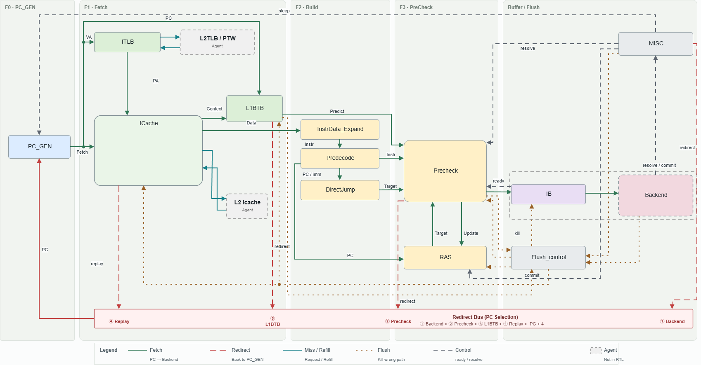

# Module: OR_FE Core Frontend

## 1. Revision

| Revision | Change Note | Author | Date |
|---|---|---|---|
| V1.0 | Initial version | OR_FE team | 2026/09/29 |

## 2. Contents

- [Module: OR\_FE Core Frontend](#module-or_fe-core-frontend)
  - [1. Revision](#1-revision)
  - [2. Contents](#2-contents)
  - [3. Overview](#3-overview)
    - [3.1 Key Features](#31-key-features)
    - [3.2 Key Parameters](#32-key-parameters)
    - [3.3 Abbreviations](#33-abbreviations)
  - [4. Top-Level Block Diagram](#4-top-level-block-diagram)
  - [5. Pipeline Stages](#5-pipeline-stages)
  - [6. Sub-Modules](#6-sub-modules)
    - [6.1 or\_fe\_top](#61-or_fe_top)
    - [6.2 PC Generation and Control](#62-pc-generation-and-control)
    - [6.3 Address Translation and Instruction Cache](#63-address-translation-and-instruction-cache)
    - [6.4 Branch Prediction and Training](#64-branch-prediction-and-training)
    - [6.5 Predecode and Expand](#65-predecode-and-expand)
    - [6.6 Precheck and Return Address Stack](#66-precheck-and-return-address-stack)
    - [6.7 IB Enqueue](#67-ib-enqueue)

## 3. Overview

OR_FE is the instruction-fetch frontend of the processor core. It fetches one 32-byte fetch line per cycle: S0 generates the fetch pc and reads the ICache and L1BTB arrays in the same cycle; S1 translates through the ITLB and compares ICache tags to select the hit way; in S2 the L1BTB gives the prediction for the line while the whole line is predecoded (instruction boundaries, control-flow types, immediates) and RVC is expanded and operand information extracted ahead of time; in S3 Precheck combines direct-jump targets, the return stack and BTB results, determines which instructions in the line are truly valid and corrects the prediction; S4 loads the whole line into the enqueue window and sends up to 2 instructions per cycle into the backend IB. The L2TLB / PTW and L2 ICache are outside the frontend and accessed through request / response interfaces. The frontend holds no architectural state; instructions sent into the IB take effect only after backend commit.

The whole pipeline has a single IB, located in the backend. The frontend has no multi-line prefetch buffer; decoupling from the backend relies solely on the backend IB. Frontend error correction has three layers: the L1BTB predicts taken branches in S2, Precheck corrects BTB mispredictions and wrong targets in S3, and the backend gives the final redirect at execute and commit. These three and ICache replay are prioritized by `pc_gen` to choose the next fetch address.

### 3.1 Key Features

- Fetches one 32-byte fetch line per cycle, processed as 16 halfword slots; supports RVC (including the 12 Zcb instructions, with legality following the `EXT_ZCB` / `EXT_ZBB` / `EXT_ZBA` switches; Zcmop is always illegal), and supports 32-bit instructions crossing lines (the line-crossing state is held in a single copy, by `predecode` only)
- The only predictor is the L1BTB (256 sets × 4 ways): read in S0; in S2 it gives the earliest predicted-taken branch in the line starting from the fetch slot and redirects in the same cycle
- In S3 `precheck` combines three candidate sources: direct-jump targets from `direct_jump`, the return address from `ras`, and BTB false hits; it compares against the L1BTB result slot by slot, takes the earliest one in slot order as the line's single redirect, and truncates the instructions after it
- Two-level redirect arbitration: within a line, `precheck` (via `slot_arb`) selects exactly one; across lines, `pc_gen` selects the next fetch address by Backend > Precheck > L1BTB > ICache replay
- `instr_data_expand` is the only RVC expansion point for instructions sent to the backend, and the backend does not expand RVC (`predecode` internally calls the same expansion function only for classification). It runs in parallel with `predecode`, expanding every slot ahead of time, keeping the raw encoding and extracting operand information. Operand information is not illegal-gated in the frontend; the backend gates it uniformly. The data bypasses predecode and Precheck and is loaded directly into the enqueue window along with its line
- VIPT ICache (128 sets × 4 ways) with a 16-entry fully associative ITLB; on an ITLB or ICache miss the line is removed from the pipeline and replayed from the original pc after translation or refill completes; no hit-under-miss
- The ICache has only one miss waiting for replay at a time; other `mshr` entries are requests canceled by a clear whose data has not yet returned, and their data is discarded on return
- The return stack is split into a speculative stack and a committed stack: the speculative stack is updated at whole-line handoff; the committed stack is maintained by the frontend itself, which records calls / returns sent into the IB in program order in an in-flight queue and pairs them with the pcs committed by the backend
- `bpf` records the prediction snapshot of fetch lines that still contain a control-flow instruction after truncation; when the backend returns a branch outcome, it is matched by branch pc to generate an L1BTB training write. BTB false hits are invalidated by `precheck`, staged in `bpf` and written into the L1BTB in a later free cycle
- Backend redirect, branch outcomes, commit, sfence, fence.i as well as sleep and CSR inputs are all registered for one cycle in `be_ctrl_reg`; the frontend does not distinguish redirect kinds. In the cycle the registered backend redirect takes effect (the cycle after the backend issues it), the enqueue window stops sending instructions
- Stages hand off through "source_destination" channels; when the backend IB is full, backpressure propagates combinationally all the way to `pc_gen`
- 39-bit virtual addresses; fetch translation supports Bare and Sv39; sfence flushes the ITLB, fence.i invalidates all ICache lines

### 3.2 Key Parameters

| Parameter | Value | Description |
|---|---:|---|
| `FETCH_BYTES` | 32 | Bytes per fetch line, equal to the ICache line size |
| `SLOT_NUM` | 16 | 16-bit halfword slots per fetch line |
| `ISSUE_W` | 2 | Instructions enqueued into the backend IB per cycle, also the width of the backend commit port |
| `VA_W` / `PA_W` | 39 / 56 | Virtual / physical address width |
| `IC_SETS` / `IC_WAYS` | 128 / 4 | ICache sets / ways (VIPT: set index and line offset both fall within the 4 KB page offset) |
| `ITLB_NUM` | 16 | ITLB entries, fully associative |
| `MSHR_NUM` | 4 | ICache MSHR entries |
| `BTB_SETS` / `BTB_WAYS` | 256 / 4 | L1BTB sets / ways |
| `RAS_DEPTH` | 16 | Speculative / committed stack depth |
| `RAS_CQ_DEPTH` | 32 | RAS in-flight call / return queue entries, no less than the sum of backend IB and ROB depths (8 + 16) |
| `BPF_DEPTH` | 16 | BPF history ring entries |
| `CAUSE_W` | 4 | Fetch exception cause width (`CAUSE_IAF` = 1, `CAUSE_IPF` = 12) |
| `PMP_CFG_W` | 64 | PMP configuration width |
| `EXT_ZCB` / `EXT_ZBB` / `EXT_ZBA` | 1 / 0 / 0 | RVC legality switches |

### 3.3 Abbreviations

| Term | Meaning |
|---|---|
| BPF | Prediction snapshot history ring (`bpf`), recording the L1BTB prediction snapshot of fetch lines that still contain a control-flow instruction after truncation, for training |
| BTB | Branch Target Buffer |
| IB | Instruction Buffer (in the backend) |
| ITLB | Instruction Translation Lookaside Buffer |
| MSHR | Miss Status Holding Register |
| PMP | Physical Memory Protection |
| PTW | Page Table Walker |
| RAS | Return Address Stack |
| RVC | RISC-V Compressed instruction |
| VIPT | Virtually Indexed, Physically Tagged |

## 4. Top-Level Block Diagram

## 5. Pipeline Stages

| Stage | Name | Main Function | Owning Modules |
|---|---|---|---|
| S0 | PC generation | Selects this cycle's fetch pc by priority among Backend / Precheck / L1BTB redirects and ICache replay, and issues the fetch request; when the request is accepted (`pcgen_ic_hsk`), starts the ICache and L1BTB array reads | `pc_gen`, `icache`, `l1btb` (→ [6.2](#62-pc-generation-and-control), [6.3](#63-address-translation-and-instruction-cache), [6.4](#64-branch-prediction-and-training)) |
| S1 | Translate / tag compare | Combinational ITLB translation; ICache compares tags and selects the hit way; on a miss the line is removed from the pipeline and a replay is registered | `itlb`, `icache` (including `tag_compare`, `mshr`) (→ [6.3](#63-address-translation-and-instruction-cache)) |
| S2 | Predict / predecode / expand | L1BTB gives the earliest predicted-taken branch in the line and redirects in the same cycle; `predecode` computes instruction boundaries, types and immediates; `instr_data_expand` expands every slot in parallel and extracts operand information | `l1btb`, `predecode`, `instr_data_expand` (→ [6.4](#64-branch-prediction-and-training), [6.5](#65-predecode-and-expand)) |
| S3 | Precheck | Direct jump and the return stack provide candidates; `precheck` corrects the L1BTB result slot by slot, truncates the line and redirects in the same cycle; RAS operations are committed at whole-line handoff | `direct_jump`, `ras`, `precheck` (including `slot_arb`) (→ [6.6](#66-precheck-and-return-address-stack)) |
| S4 | IB enqueue | Loads the line into `ib_enq_window` at whole-line handoff, and records the line's prediction snapshot in `bpf` in the same cycle if it still contains a control-flow instruction after truncation; sends up to 2 instructions per cycle into the backend IB; the next line can be loaded in the same cycle the current line finishes | `ib_enq_window`, `bpf` (→ [6.7](#67-ib-enqueue), [6.4](#64-branch-prediction-and-training)) |

Between adjacent stages there is one handoff channel: `pcgen_ic` (S0→S1), `ic_predcd` (S1→S2), `predcd_prechk` (S2→S3), `prechk_ib_alloc` (S3→S4). The first three channels each have a stage of valid-bit and pc registers, held by `or_fe_top`; `prechk_ib_alloc` has no channel register, and handoff means loading into `ib_enq_window`. A redirect only clears channel valid bits and carries no transaction tag. The S2 L1BTB redirect and the S3 Precheck redirect are both issued in the cycle the stage is valid, only once per line, without waiting for downstream ready.

A pipeline stage carries only one line's fetch result: a missed line is removed from the pipeline, and `icache` records its pc to await replay; prediction snapshots are stored in `bpf`, and calls / returns already sent into the IB are stored in `ras`'s in-flight queue.

## 6. Sub-Modules

Each sub-module lists only its responsibility, the state it holds and its main upstream/downstream; behavior, interfaces and timing are defined by the linked module documents. `tag_compare` and `mshr` are described with `icache`, and `slot_arb` with `precheck`. Common parameters, types and functions are in [OR_FE_common.md](../OR_FE_common.md).

### 6.1 or_fe_top

**`or_fe_top`** ([OR_FE_top.md](../OR_FE_top.md))

- Responsibility: frontend integration layer; instantiates and wires the sub-modules, and itself holds the three inter-stage channels `pcgen_ic`, `ic_predcd` and `predcd_prechk`. Each channel hands off when the upstream line is ready and the stage is empty or its line is taken by downstream / cleared in this cycle (`pcgen_ic` additionally requires that `icache` can accept the request); a clear only invalidates the stage's valid bit. When `icache` removes the S1 line from the pipeline, `pcgen_ic` is cleared as well. `prechk_ib_alloc` has no channel register and hands off whenever `ib_enq_window` can load (`bpf` exerts no backpressure).
- State: valid bits and pc of the `pcgen_ic` / `ic_predcd` channels; valid bit and pc of the `predcd_prechk` channel, plus the line's Expand data (`inst`, `raw`, `is_rvc`, `rvc_ill`, `opnd`, line-crossing flag).
- External boundary: backend redirect (`be_redirect`), branch outcomes (`be_commit_br`), commit port (`be_commit` / `be_commit_pc`), `be_sfence`, `be_fence_i`; `ib_enq_vld` / `ib_enq_payload` / `ib_enq_rdy` to the backend IB; `ptw_req` / `ptw_resp` to the L2TLB / PTW; `l2_req` / `l2_cancel` / `l2_resp` to the L2 ICache; `boot_pc`, `sleep_req` and CSR inputs (`csr_vm_en`, `csr_priv`, `csr_pmp_cfg`).

### 6.2 PC Generation and Control

**`pc_gen`** ([PC_GEN.md](../PC_GEN.md))

- Responsibility: S0 fetch address generation. In the first cycle after reset it loads `boot_pc` and enters `RUN`. It selects the redirect target by priority Backend > Precheck > L1BTB > ICache replay and combinationally switches the fetch pc in the same cycle; without a redirect it advances line by line, moving pc to the next line base after the fetch request is accepted. When `icache` removes a line from the pipeline and there is no redirect in this cycle, it enters `WAIT_REPLAY` and stops issuing requests until a replay or redirect; it also stops issuing requests while `sleep_stall` is asserted.
- State: `RESET` / `RUN` / `WAIT_REPLAY` state and the current pc.
- Upstream/downstream: `be_ctrl_reg` (redirect, `sleep_stall`), `precheck`, `l1btb`, `icache` (replay, `miss_drop`), `boot_pc` → `pc_gen` → `pcgen_ic` channel, `icache` / `l1btb` array reads.

**`MISC`** ([BE_CTRL_REG.md](../BE_CTRL_REG.md))

- Responsibility: boundary with the backend and the CSR control plane. Registers the backend redirect, branch outcomes (`be_commit_br`, by branch pc), commit port (`be_commit` / `be_commit_pc`), sfence, fence.i, as well as `sleep_req`, `csr_vm_en`, `csr_priv` and `csr_pmp_cfg` for one cycle, then distributes them:
  - The registered backend redirect produces a frontend-wide `flush` in the same cycle.
  - The registered sfence becomes `itlb`'s `tlb_flush`; the registered fence.i becomes the full invalidation of `icache` (`ic_inv`).
  - The registered sleep becomes the stall signal `sleep_stall`, whose rising edge produces a one-cycle `sleep_flush`.
- State: one-cycle registers for each input (`priv` resets to M; valid bits, `vm_en` and `pmp_cfg` reset to 0; data fields are not reset), plus the previous-cycle sleep used to generate the sleep flush.
- Upstream/downstream: backend / CSR → `be_ctrl_reg` → `pc_gen` (redirect, `sleep_stall`), `flush_control` (`flush`, `sleep_flush`), `bpf` (branch outcomes), `ras` (commit pc), `itlb` (`tlb_flush`, `vm_en` / `priv` / `pmp_cfg`), `icache` (`ic_inv`).

**`flush_control`** ([FLUSH_CONTROL.md](../FLUSH_CONTROL.md))

- Responsibility: purely combinational; translates error events into channel clears and module flushes:
  - Backend flush or sleep flush: clears the `predcd_prechk`, `ic_predcd` and `pcgen_ic` channels, empties `ib_enq_window`, restores the RAS speculative stack from the committed stack and empties the in-flight queue. A sleep flush is not accompanied by a redirect.
  - Precheck redirect: clears `ic_predcd` and `pcgen_ic`.
  - L1BTB redirect: clears `pcgen_ic`.
  - Whenever `pcgen_ic` is cleared, the ICache miss waiting for replay is also canceled (outstanding requests in `mshr` are canceled together), and `predecode`'s line-crossing state is invalidated.
- State: none.
- Upstream/downstream: `l1btb`, `precheck`, `be_ctrl_reg` → `flush_control` → `or_fe_top` channels, `icache`, `predecode`, `ib_enq_window`, `ras`, `l1btb`, `precheck` (clear already-redirected flag).

### 6.3 Address Translation and Instruction Cache

**`itlb`** ([ITLB.md](../ITLB.md))

- Responsibility: 16-entry fully associative instruction TLB. In S1 it looks up the current line combinationally and gives hit, physical tag and fetch exception (missing X permission, or U / S mismatch with the page U bit, reports a page fault; exceptions returned by the PTW are reported as page fault or access fault according to their cause); Bare mode passes through. On a miss it sends one request to the L2TLB / PTW, with only one outstanding at a time. A normal response is filled in round-robin; an exception response is staged as a single exception, to be hit and reported by the lookup after replay; any response arrival notifies `icache`. sfence (`tlb_flush`) invalidates all entries and the staged exception; if sfence arrives while a request is outstanding, that request's response is discarded.
- State: per-entry valid bit, vpn, page level (4K / 2M / 1G), ppn, x / u / pbmt; PTW request state `IDLE` / `REQ` / `RESP` and request vpn; outstanding-response discard flag; staged exception; replacement pointer.
- Upstream/downstream: `pcgen_ic` channel, `be_ctrl_reg` → `itlb` ↔ L2TLB / PTW; `itlb` → `icache` (hit, physical tag, exception, PTW idle, translation response arrival).

**`icache`** ([ICACHE.md](../ICACHE.md), with sub-modules `tag_compare` ([TAG_COMPARE.md](../TAG_COMPARE.md)) and `mshr` ([MSHR.md](../MSHR.md)))

- Responsibility: VIPT instruction cache. S0 reads the tag / data arrays on `pcgen_ic_hsk`; in S1, `tag_compare` (purely combinational) compares each way's tag against the physical tag from the ITLB and selects the hit way; the result line is registered on `ic_predcd_hsk`, and S2 outputs 16 halfwords and the fetch exception. A line for which the ITLB reports an exception does not look up the cache and is passed to S2 directly with the exception.
  - When no miss is currently waiting for replay, an ITLB miss (with the PTW idle) or a cache miss (with a free `mshr` entry) removes the line from the pipeline (`miss_drop`) and records its pc; a cache miss also allocates an `mshr` entry recording the physical line address and the refill target set / way, with the replacement way chosen round-robin at this point. If the conditions are not met, the line stays in S1 and waits.
  - `mshr` sends at most one request per cycle to the L2 ICache; L2 responds by ID, and responses for non-canceled entries are used for refill and free the entry.
  - A replay is issued when the translation response arrives or the corresponding refill completes. When `pcgen_ic` is cleared, the wait is canceled and no replay is issued, and all outstanding `mshr` entries are canceled: those already sent issue `l2_cancel` and are freed after the returned data is discarded; those not yet sent are freed directly.
  - The refill writes the way chosen at miss time; fence.i invalidates all lines, and a refill in the same cycle as fence.i does not write the arrays; no new fetch request is accepted in the refill-complete cycle or the fence.i cycle.
- State: tag / data arrays and per-line valid bits, S1 read-out registers, S2 result registers, replay wait state (`P_IDLE` / `P_WAIT_TLB` / `P_WAIT_L2`) and pc, the awaited MSHR ID, replacement pointer; per `mshr` entry `FREE` / `PEND` / `CANCEL`, sent flag, physical line address and target set / way.
- Upstream/downstream: `pcgen_ic` channel, `itlb`, `be_ctrl_reg` (`ic_inv`), `flush_control` → `icache` ↔ L2 ICache (`mshr`'s `l2_req` / `l2_cancel` / `l2_resp`); `icache` → `predecode`, `instr_data_expand` (result line), `pc_gen` (replay, `miss_drop`), `or_fe_top` (`req_rdy`, `rsp_vld`, `miss_drop`).

### 6.4 Branch Prediction and Training

**`l1btb`** ([L1BTB.md](../L1BTB.md))

- Responsibility: the only branch predictor, 256 sets × 4 ways; each entry records tag, slot, type, 2-bit counter and target. S0 reads on `pcgen_ic_hsk`, and the read-out is registered on `ic_predcd_hsk`. In S2, among hit entries whose slot is not less than the fetch slot, it finds the predicted-taken one (an unconditional jump, or a conditional branch whose counter MSB is 1) with the earliest slot (lowest way within the same slot) and redirects in the same cycle, only once per line. The line's prediction snapshot (per-way hit, slot, counter, taken flag, taken way, slot, type, target) is passed to S3 on `predcd_prechk_hsk`. Training writes come from `bpf`, in three modes: update, allocate and invalidate.
- State: BTB array and per-entry valid bits, S1 read-out registers, S2 read-out registers awaiting comparison, the prediction snapshot passed to S3, the line's already-redirected flag.
- Upstream/downstream: `pcgen_ic` / `ic_predcd` / `predcd_prechk` channels, `flush_control` (clear already-redirected flag) → `l1btb` → `pc_gen`, `flush_control` (redirect), `precheck` (prediction snapshot); `bpf` → `l1btb`.

**`bpf`** ([BPF.md](../BPF.md))

- Responsibility: 16-entry prediction-snapshot history ring. At whole-line handoff, a line that still contains a control-flow instruction after truncation writes one entry (line pc, prediction snapshot, control-flow slot mask, line-crossing flag); when full it overwrites the oldest entry, exerts no backpressure and is not truncated by flush. When the backend returns a branch outcome, it finds the youngest matching entry in the ring by branch pc: if the branch's slot hit in the prediction snapshot, it generates an L1BTB update write (counter saturating increment/decrement, target written when actually taken); if it missed and was actually taken, it generates an allocate write (counter set to weakly taken, allocation way rotates). BTB invalidations from `precheck` are staged first and written into the L1BTB in a cycle with no training write.
- State: per-entry valid bit, line pc, prediction snapshot, control-flow slot mask and line-crossing flag; write pointer; staged BTB invalidation; rotation pointer for the L1BTB allocation way.
- Upstream/downstream: `precheck`, `be_ctrl_reg` → `bpf` → `l1btb`, `precheck` (BPF entry index).

### 6.5 Predecode and Expand

**`predecode`** ([PREDECODE.md](../PREDECODE.md))

- Responsibility: the frontend's only instruction-boundary computation. In S2, starting from the fetch slot (from slot 0 when there is line-crossing state), it determines slot by slot whether each is an instruction start, whether it is RVC and whether it is complete, and decodes the control-flow type and direct-jump immediate (RVC is first passed through the expansion function and then classified; the expansion result is not output). Results are registered on `predcd_prechk_hsk`; S3 outputs per-slot valid bit, start, type, immediate, instruction pc, return address and the line's fetch exception. For an incomplete 32-bit instruction at the end of a line, the first half is saved as line-crossing state for the next line; it is invalidated when `pcgen_ic` is cleared. In a line with a fetch exception, all slots are invalid and no line-crossing state is produced.
- State: line-crossing state (valid bit and the first halfword), S3 predecode result registers.
- Upstream/downstream: `icache`, `ic_predcd` channel, `flush_control` → `predecode` → `direct_jump`, `ras`, `precheck`; line-crossing state → `instr_data_expand`, `or_fe_top` (line-crossing flag of the `predcd_prechk` channel).

**`instr_data_expand`** ([INSTR_DATA_EXPAND.md](../INSTR_DATA_EXPAND.md))

- Responsibility: purely combinational; the only RVC expansion point for instructions sent to the backend. In S2 it expands every slot ahead of time without regard to instruction boundaries, outputting the 32-bit expanded word, the raw encoding (only the low 16 bits valid for RVC), whether it is RVC, whether the RVC encoding is illegal (following the `EXT_*` switches) and operand information (not illegal-gated); for slot 0 in the line-crossing case it concatenates the first half saved by `predecode`. The data bypasses predecode and Precheck; it is registered by `or_fe_top`'s `predcd_prechk` channel and loaded directly into `ib_enq_window`.
- State: none.
- Upstream/downstream: `icache`, `predecode` (line-crossing state) → `instr_data_expand` → `predcd_prechk` channel → `ib_enq_window`.

### 6.6 Precheck and Return Address Stack

**`direct_jump`** ([DIRECT_JUMP.md](../DIRECT_JUMP.md))

- Responsibility: purely combinational. In S3 it computes the jump target (instruction pc + immediate) for every valid conditional branch, direct jump and direct call, as candidates for Precheck.
- State: none.
- Upstream/downstream: `predecode` → `direct_jump` → `precheck`.

**`ras`** ([RAS.md](../RAS.md))

- Responsibility: 16-deep return address stack, split into a speculative stack and a committed stack, plus a 32-entry in-flight call / return queue.
  - In S3 it reads the top of the speculative stack as the candidate target for a return (including return-and-call, which pops then pushes); when the stack is empty it gives no candidate and does not modify the stack. At whole-line handoff it performs a push, pop or pop-then-push for the earliest call / return within the line's truncation range given by `precheck`.
  - When instructions are sent into the backend IB, calls / returns (except fetch-exception entries) are recorded in program order in the in-flight queue, and dropped when the queue is full; when a pc committed by the backend equals the queue head, the head is dequeued and the same operation is applied to the committed stack.
  - On backend flush or sleep flush, the speculative stack is restored from the committed stack (including same-cycle commits) and the in-flight queue is emptied.
- State: speculative stack with stack pointer and count, committed stack with stack pointer and count, in-flight queue with read/write pointers.
- Upstream/downstream: `predecode`, `precheck`, `ib_enq_window`, `be_ctrl_reg`, `flush_control` → `ras` → `precheck`.

**`precheck`** ([PRECHECK.md](../PRECHECK.md), with sub-module `slot_arb` ([SLOT_ARB.md](../SLOT_ARB.md)))

- Responsibility: S3 error correction and truncation; first-level arbitration of the line's redirect.
  - At and before the L1BTB predicted-taken position (not checked for lines with a fetch exception), it determines slot by slot whether a redirect is needed: the BTB predicts taken on an invalid slot or a non-control-flow instruction (a false hit; the target is the instruction's own pc if the slot is the start of an incomplete 32-bit instruction at the end of the line, otherwise the next sequential instruction); a conditional branch, direct jump or call is predicted taken but its target differs from `direct_jump`, or a direct jump / call is not predicted taken; a return is not predicted taken, or its target differs from the top of `ras`. `slot_arb` (purely combinational) selects the earliest one in slot order and gives its slot and target.
  - The redirect is issued in the cycle the stage is valid, once per line, without waiting for downstream ready; it also acts as an early kill that clears younger lines.
  - Provides the load control for `ib_enq_window`: valid slots after truncation, truncation position, the predicted direction and target at that position, fetch exception, BPF entry valid bit and index.
  - Commits at whole-line handoff: the earliest call / return within the truncation range goes to `ras`; a line that still contains a control-flow instruction after truncation is written to `bpf`; if the winning redirect is a BTB false hit, the corresponding BTB entry is invalidated via `bpf`.
- State: the line's already-redirected flag.
- Upstream/downstream: `predecode`, `l1btb`, `direct_jump`, `ras`, `bpf` → `precheck` → `pc_gen`, `flush_control` (redirect), `ib_enq_window`, `ras`, `bpf`.

### 6.7 IB Enqueue

**`ib_enq_window`** ([IB_ENQ_WINDOW.md](../IB_ENQ_WINDOW.md))

- Responsibility: the S4 window that enqueues into the backend IB, holding only one line. The backend IB accepts at most 2 instructions per cycle while a line holds up to 16, so the line must be held and advanced as it is sent.
  - On load, the valid slots after truncation are compacted into a contiguous sequence; afterwards each cycle presents the 2 earliest remaining instructions, handshakes with the backend IB via per-lane valid / ready, and advances by the number accepted this cycle (the backend accepts a contiguous lane prefix).
  - Each instruction carries pc, expanded word, raw encoding, RVC flag, RVC-illegal flag, operand information, predicted direction (only the instruction at the truncation position is taken) and target, BPF entry valid bit, index and slot; a line with a fetch exception sends only one exception instruction, carrying cause and faulting address (the raw encoding is a NOP, and in the line-crossing case pc is the start of the line-crossing instruction).
  - The next line can be loaded in the same cycle the current line finishes, with no bubble between lines.
  - On flush (backend flush or sleep flush), it stops sending in that cycle and empties the window.
- State: window valid bit, number of instructions sent, total number to send, plus the line's compacted sequence and line control information.
- Upstream/downstream: `predcd_prechk` channel (Expand data), `precheck` (load control), `flush_control` → `ib_enq_window` ↔ backend IB; `ib_enq_window` → `ras` (instructions sent into the IB).
