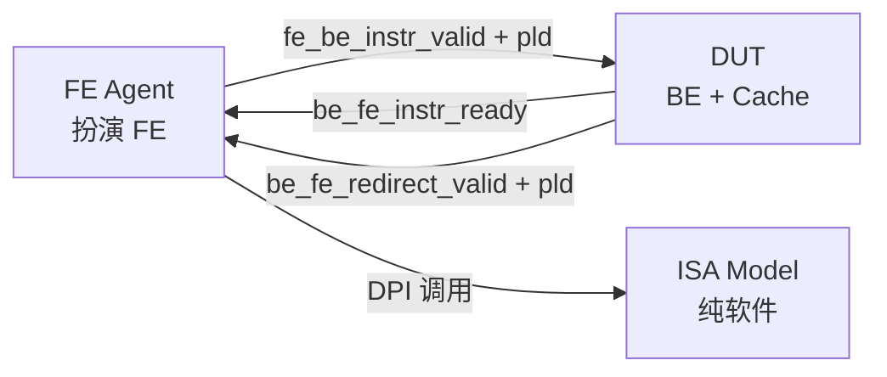

# Agent `FE Agent`

`FE Agent`：ORBE BT 验证环境中扮演 RTL FE 的协议适配器；从 ISA Model 取指，按 `orbe_fe_if` 的握手把 raw instruction 交给 DUT。

**类型**：协议适配器 / 调用定序器

**基本 property**：

1. 只做两件事：按固定顺序调用 ISA Model DPI；维护 `orbe_fe_if` 上的事件时序。
2. 不持有架构状态；architectural state 的唯一 owner 是 ISA Model。
3. 不参与 decode、execute、commit，不判断分支方向。
4. 事件与 payload 必须与真实 FE 一致；对齐的是事件词汇与 payload schema，不是延迟或流水线形状。
5. 本阶段不追求时序精确。

三方关系：

> 本实例对骨架的改写只有一处，先在此声明，后文不再重复：
> 公式树的终端除 `Interface` 与 `Data structure` 外，允许引用 ISA Model 的纯组合读——本 Agent 的数据来源之一是外部软件模型，不是边界信号。

## FSM

### State

1. `RESET`：复位有效，输出静止。
2. `RUN`：取指与交付。
3. `EXIT`：模型请求退出，停止输出并收尾。

三者都不对应存储：`RESET` 由 `rst_n` 判定，`RUN` 为默认态，`EXIT` 为瞬态。真实存储见 `Data structure -> State`。

### State Transition & Condition Name

1. `ANY -> RESET`：`reset`
2. `RESET -> RUN`：`start`
3. `RUN -> EXIT`：`exit`
4. `RUN -> RUN`：`redirect`
5. `RUN -> RUN`：`deliver[lane]`

### Detailed Condition Description

1. `reset`：复位，输出静止。
	- Fire来源：`reset.fire = ¬rst_n`
		- `rst_n`：低有效复位，见 `Interface -> In Static Info` 第 3 条。
	- Constraint：异步复位；优先于本 Agent 的全部其他动作。
	- Payload：∅；复位有效时立即生效。
	- Side effect：无。

2. `start`：执行前置序列，取得入口 PC，进入取指循环。
	- Fire来源：`start.fire = rst_n`
		- `rst_n`：见 `Interface -> In Static Info` 第 3 条。
	- Constraint：全生命周期内只 fire 一次，即复位释放那一拍。
	- Payload：∅。
	- Side effect：按下列顺序执行前置序列，并初始化取指游标。
		- `isa_dpi_create`：创建共享模型实例。
			- 入参：`core_num = 1`、`rob_size = 16`（模型 ROB 容量，与 DUT 发射宽度无关）。
			- 返回码：`PASS` / `FAIL`；非 `PASS` 终止。
		- `isa_dpi_set_run_log` + `isa_dpi_enable_run_log`：设置并打开 run log。
			- 入参：日志路径、`ISA_API_LOG_GLOBAL`。
			- 返回码：`void`。
			- 可选：由 plusarg 触发；未触发时跳过。
		- `isa_dpi_set_commit_log` + `isa_dpi_enable_commit_log`：设置并打开 commit log。
			- 入参：日志路径、`ISA_API_LOG_GLOBAL`。
			- 返回码：`void`。
			- 可选：由 plusarg 触发；未触发时跳过。
		- `isa_dpi_load_config`：加载平台、内存、设备配置。
			- 入参：YAML 路径。
			- 返回码：`PASS` / `FAIL`；非 `PASS` 终止。
		- `isa_dpi_load_elf`：装载 ELF 指令/数据并建立入口信息。
			- 入参：ELF 路径。
			- 返回码：`PASS` / `FAIL`；非 `PASS` 终止。
		- `isa_dpi_add_arg`：向目标程序传 argv，本阶段传 ELF 路径。
			- 入参：ELF 路径。
			- 返回码：`void`，无返回码。
		- `isa_dpi_finalize_config`：完成配置，此后取指读才可用。
			- 入参：无。
			- 返回码：`PASS` / `FAIL`；非 `PASS` 终止。
		- `isa_dpi_get_spec_pc`：取入口 PC。
			- 入参：`model_core_id = 0`。
			- 返回码：64 bit PC，即 `initial_pc`。
			- 全生命周期内只调用一次。
		- 存储更新：`next_pc <- initial_pc`；`fault_entry_sent <- 0`。
			- `initial_pc`：本条 `isa_dpi_get_spec_pc` 的返回值。

3. `exit`：停止输出，执行收尾序列。
	- Fire来源：`exit.fire = isa_dpi_is_to_exit()`
		- `isa_dpi_is_to_exit()`：ISA Model DPI，返回 1 bit 退出请求标志；纯组合读、无副作用、任意拍可调用。
	- Constraint：优先于 `redirect` 与 `deliver`；本拍 `deliver = 00`。
	- Payload：∅。
	- Side effect：按下列顺序执行收尾序列。
		- `isa_dpi_is_good`：查询退出结果。
			- 入参：无。
			- 返回码：`0` / `1`。
		- `isa_dpi_destroy`：释放共享模型实例。
			- 入参：无。
			- 返回码：`void`，无返回码。
			- 与 `isa_dpi_create` 配对；本 Agent 是共享模型的 create / destroy 唯一 owner。

4. `redirect`：丢弃当前取指位置，把游标重载到 redirect 目标。
	- Fire来源：`redirect.fire = be_fe_redirect_valid ∧ ¬exit.fire`
		- `be_fe_redirect_valid`：见 `Interface -> In-event` 第 1 条。
		- `exit.fire`：见本节第 3 条。
	- Constraint：与本节第 5 条互斥，互斥项写在第 5 条的 fire 内。
	- Payload：∅。
	- Side effect：`next_pc <- be_fe_redirect_pld.redirect_pc`；`fault_entry_sent <- 0`。
		- `be_fe_redirect_pld`：见 `Interface -> In-event` 第 1 条。

5. `deliver[lane]`：完成一次指令交付，并推进取指游标。
	- Fire来源：`deliver[lane].fire = instr_valid[lane] ∧ be_fe_instr_ready[lane] ∧ ¬exit.fire ∧ ¬redirect.fire`
		- `instr_valid[lane]`：本拍本 Agent 在 lane 上是否提供一条指令。
			- `instr_valid[lane] = (mode = INSN) ∨ (lane = 0 ∧ mode = FAULT_PENDING)`
				- `mode`：本拍 `fetch` 的分类。
					- `mode = INSN` 当 `rc = PASS ∧ low_half ≠ 16'h0000`。
					- `mode = EOF` 当 `rc = PASS ∧ low_half = 16'h0000`。
					- `mode = FAULT_PENDING` 当 `rc ≠ PASS ∧ trap ∈ TRAP_SET ∧ ¬fault_entry_sent`。
					- `mode = FAULT_DONE` 当 `rc ≠ PASS ∧ trap ∈ TRAP_SET ∧ fault_entry_sent`。
						- `rc`、`low_half`、`trap`：见本条 `fetch`。
						- `fault_entry_sent`：见 `Data structure -> State` 第 2 条。
						- `TRAP_SET = {INSN_ADDR_MISSALIGN, INSN_ACCESS_FAULT, INSN_PAGE_FAULT}`：其余取值报错终止。
				- `fetch`：每拍对 `next_pc` 做一次取指读。
					- `fetch = isa_dpi_fetch_mem_bank_virt(0, next_pc, 2) → (rc, low_half, trap)`：ISA Model DPI；纯组合读、无副作用、允许重复调用。
						- `next_pc`：见 `Data structure -> State` 第 1 条。
		- `be_fe_instr_ready[lane]`：见 `Interface -> In Static Info` 第 1 条。
		- `exit.fire`、`redirect.fire`：见本节第 3、4 条。
	- Constraint：`instr_valid[1] -> instr_valid[0]`；`deliver` 向量只能为 `00`、`01`、`11`。
	- Payload：`orbe_fe_instr_pld_t`；当拍有效。
	- Side effect：`next_pc <- next_pc + advance`；`fault_entry_sent <- fault_entry_sent ∨ (mode = FAULT_PENDING ∧ deliver[0].fire)`
		- `advance = (mode = INSN) ? ((deliver[0].fire ? inst_len_0 : 0) + (deliver[1].fire ? inst_len_1 : 0)) : 0`
			- `mode`：见本条 `Fire来源`。
			- `deliver[lane].fire`：见本条 `Fire来源`。
			- `inst_len_0 = is_compressed_0 ? 2 : 4`
				- `is_compressed_0`：见 `Interface -> Out-event` 第 1 条。
			- `inst_len_1 = is_compressed_1 ? 2 : 4`
				- `is_compressed_1`：见 `Interface -> Out-event` 第 1 条。
		- `mode`、`deliver[0].fire`：见本条 `Fire来源`。

## Data structure

### State

1. `next_pc`：64 bit；取指游标（指针）。由 `start` 置为 `initial_pc`，由 `redirect` 重载为 redirect 目标，由 `deliver` 按 `advance` 推进。
2. `fault_entry_sent`：1 bit；由 `start` 与 `redirect` 清 0，由 `deliver` 在交付异常 entry 时置 1。

对外 payload 不存储：它每拍由 `next_pc` 组合导出，见 `Interface -> Out-event`。

### Header

无。

### Payload

无。

## Interface

### In-event

1. `redirect`：Notify，单 lane
	- Fire来源：`be_fe_redirect_valid`
	- Payload：`orbe_fe_redirect_pld_t`；当拍有效
	`orbe_fe_redirect_pld_t`：`redirect_pc` 64 bit × 1、`interrupt_valid` 1 bit × 1、`trap_valid` 1 bit × 1
	- Constraint：本 Agent 不做同拍抑制，flush 那一拍 DUT 侧的 ready 已为 0；`interrupt_valid` / `trap_valid` 只标识本次 redirect 的成因，对 Agent 是信息性的，Agent 的动作只由 `redirect_pc` 决定。
		- 中断与同步异常本身的处理（trap vector、`mepc`/`sepc`/CSR 更新、模型侧 `isa_dpi_take_interrupt` / `isa_dpi_trigger_trap`）全部属于 DUT 与 BE 驱动的 ISA Model，不在本 Agent 内。

### In Static Info

1. `be_fe_instr_ready[lane]`：1 bit × 2，`lane∈{0,1}`；当前拍 DUT 是否接收 lane。组合依赖 `fe_be_instr_valid[lane]`，见 `Interface -> Out-event` 第 1 条。
2. `clk`：时钟。
3. `rst_n`：1 bit；低有效复位。

### Out-event

1. `instr[lane]`：Transaction，`lane∈{0,1}`
	- Fire来源：见 `FSM -> Detailed Condition Description` 第 5 条
	- Payload：`orbe_fe_instr_pld_t`；当拍有效
	`orbe_fe_instr_pld_t`：`pc` 64 bit × 2、`inst_bits` 32 bit × 2、`is_compressed` 1 bit × 2、`pred_taken` 1 bit × 2、`pred_target_pc` 64 bit × 2、`fetch_excp_vld` 1 bit × 2、`exception_cause` 5 bit × 2、`exception_tval` 64 bit × 2
		- `pc[lane] = next_pc + (lane = 0 ? 0 : inst_len_0)`
			- `next_pc`：见 `Data structure -> State` 第 1 条。
			- `inst_len_0`：见 `FSM -> Detailed Condition Description` 第 5 条。
		- `is_excp_entry[lane] = (lane = 0) ∧ (mode = FAULT_PENDING)`
			- `mode`：见 `FSM -> Detailed Condition Description` 第 5 条。
		- `is_compressed[lane] = is_excp_entry[lane] ? 0 : (half(pc[lane])[1:0] ≠ 2'b11)`
			- `is_excp_entry[lane]`：见本条第 2 项。
			- `pc[lane]`：见本条第 1 项。
			- `half(a) = fetch(a).low_half`；`fetch`：见 `FSM -> Detailed Condition Description` 第 5 条。
		- `inst_bits[lane] = is_excp_entry[lane] ? 32'h0000_0013 : (is_compressed[lane] ? {16'h0000, half(pc[lane])} : {half(pc[lane] + 2), half(pc[lane])})`
			- `is_excp_entry[lane]`：见本条第 2 项。
			- `is_compressed[lane]`：见本条第 3 项。
			- `half(a)`：见本条第 3 项。
		- `pred_taken[lane] = 0`
			- 本阶段不做分支预测，恒为 0。
		- `pred_target_pc[lane] = is_excp_entry[lane] ? pc[lane] : pc[lane] + inst_len(lane)`
			- `is_excp_entry[lane]`：见本条第 2 项。
			- `pc[lane]`：见本条第 1 项。
			- `inst_len(lane) = is_compressed[lane] ? 2 : 4`
				- `is_compressed[lane]`：见本条第 3 项。
		- `fetch_excp_vld[lane] = is_excp_entry[lane]`
			- `is_excp_entry[lane]`：见本条第 2 项。
		- `exception_cause[lane] = is_excp_entry[lane] ? trap[4:0] : 0`
			- `is_excp_entry[lane]`：见本条第 2 项。
			- `trap`：见 `FSM -> Detailed Condition Description` 第 5 条。
		- `exception_tval[lane] = is_excp_entry[lane] ? excp_tval : 0`
			- `excp_tval = (low_half 处发生 fault) ? pc[lane] : pc[lane] + 2`
				- `low_half 处发生 fault`：见 `FSM -> Detailed Condition Description` 第 5 条 `fetch` 的实现约束。
				- `pc[lane]`：见本条第 1 项。

### Out Static Info

无。

### Interface Timing

1. `clk`：所有同步状态在上升沿更新；组合输出在当前拍有效。
2. `rst_n`：低有效异步复位；有效时 `fe_be_instr_valid = 00` 且 payload 全 0。
3. `Transaction`：`instr[lane]` 与 `be_fe_instr_ready[lane]` 同拍完成握手，fire 定义见 `FSM -> Detailed Condition Description` 第 5 条；未 fire 的 payload 由游标冻结保证稳定；`fe_be_instr_valid[lane]` 不得组合依赖 `be_fe_instr_ready[lane]`。
4. `Notify`：`redirect` 无 ready、无背压；DUT 在 flush 那一拍已把 ready 置 0，因此该拍不产生 fire。
5. `Static Info`：`be_fe_instr_ready[lane]` 为当前拍组合值。
